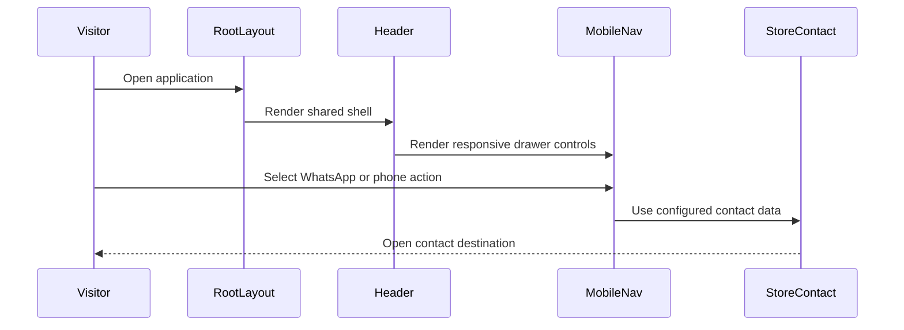

<!-- This is an auto-generated comment: summarize by coderabbit.ai -->
<!-- review_stack_entry_start -->

[](https://app.coderabbit.ai/change-stack/erfanansarioct10-oss/muscleworks/pull/2?utm_source=github_walkthrough&utm_medium=github&utm_campaign=change_stack)

<!-- review_stack_entry_end -->
<!-- walkthrough_start -->

<details>
<summary>📝 Walkthrough</summary>

## Walkthrough

The starter Next.js app is replaced with a MuscleWorks Supplements foundation. The change adds project specifications, typed contracts, shared utilities, UI primitives, responsive navigation, metadata, error handling, image configuration, and package dependencies.

### Changes

**MuscleWorks foundation**

|Layer / File(s)|Summary|
|---|---|
|**Governance and specifications** <br> `AGENTS.md`, `context/...`|Adds project operating rules, architecture documents, data-model guidance, roadmap phases, feature specifications, progress tracking, and coding standards.|
|**Scaffold and configuration** <br> `.gitignore`, `next.config.ts`, `package.json`, `tsconfig.json`|Updates package metadata, dependencies, image handling, path aliases, and ignored files.|
|**Data and utility foundations** <br> `src/lib/*`, `src/types/*`, `src/app/globals.css`|Adds store constants, formatting helpers, action-result contracts, shared application types, and dark athletic theme tokens.|
|**UI primitives** <br> `src/components/ui/*`|Adds buttons, badges, cards, inputs, textareas, selects, separators, skeletons, dialogs, sheets, breadcrumbs, and toast helpers.|
|**Application shell** <br> `src/app/*`, `src/components/layout/*`|Adds the root layout, metadata, home and 404 pages, error boundaries, desktop navigation, mobile navigation, and WhatsApp contact actions.|
|**Starter app removal** <br> `app/*`|Removes the original root layout, global stylesheet, and default home page. There are no remaining public exports from those files.|

**Estimated code review effort:** 4 (Complex) | ~45 minutes

### Sequence Diagram(s)



**Possibly related PRs**

- [erfanansarioct10-oss/muscleworks#1](https://github.com/erfanansarioct10-oss/muscleworks/pull/1): Adds related foundational project documentation and scaffold work.

</details>

<!-- walkthrough_end -->
<!-- pre_merge_checks_walkthrough_start -->

<details>
<summary>🚥 Pre-merge checks | ✅ 4 | ❌ 1</summary>

### ❌ Failed checks (1 warning)

|     Check name     | Status     | Explanation                                                                           | Resolution                                                                         |
| :----------------: | :--------- | :------------------------------------------------------------------------------------ | :--------------------------------------------------------------------------------- |
| Docstring Coverage | ⚠️ Warning | Docstring coverage is 25.00% which is insufficient. The required threshold is 80.00%. | Write docstrings for the functions missing them to satisfy the coverage threshold. |

<details>
<summary>✅ Passed checks (4 passed)</summary>

|         Check name         | Status   | Explanation                                                                                                                                                                            |
| :------------------------: | :------- | :------------------------------------------------------------------------------------------------------------------------------------------------------------------------------------- |
|      Description Check     | ✅ Passed | Check skipped - CodeRabbit’s high-level summary is enabled.                                                                                                                            |
|         Title check        | ✅ Passed | The title clearly identifies the CodeRabbit review-resolution work documented in the changeset, although the pull request also includes broader project scaffolding and documentation. |
|     Linked Issues check    | ✅ Passed | Check skipped because no linked issues were found for this pull request.                                                                                                               |
| Out of Scope Changes check | ✅ Passed | Check skipped because no linked issues were found for this pull request.                                                                                                               |

</details>

</details>

<!-- pre_merge_checks_walkthrough_end -->
<!-- finishing_touch_checkbox_start -->

<details>
<summary>✨ Finishing Touches 💡 1</summary>

<!-- finishing_touch_suggestion:docstrings -->
<details>
<summary>📝 Generate docstrings 💡</summary>

- [ ] <!-- {"checkboxId": "7962f53c-55bc-4827-bfbf-6a18da830691"} --> Create stacked PR
- [ ] <!-- {"checkboxId": "3e1879ae-f29b-4d0d-8e06-d12b7ba33d98"} --> Commit on current branch

</details>
<details>
<summary>🧪 Generate unit tests (beta)</summary>

- [ ] <!-- {"checkboxId": "f47ac10b-58cc-4372-a567-0e02b2c3d479", "radioGroupId": "utg-output-choice-group-unknown_comment_id"} -->   Create PR with unit tests
- [ ] <!-- {"checkboxId": "6ba7b810-9dad-11d1-80b4-00c04fd430c8", "radioGroupId": "utg-output-choice-group-unknown_comment_id"} -->   Commit unit tests in branch `01-coderabbit-review-resolutions`

</details>

</details>

<!-- finishing_touch_checkbox_end -->
<!-- tips_start -->

---


<sub>Comment `@coderabbitai help` to get the list of available commands.</sub>

<!-- tips_end -->


> [!NOTE]
> Due to the large number of review comments, Critical severity comments were prioritized as inline comments.

> [!CAUTION]
> Some comments are outside the diff and can’t be posted inline due to platform limitations.
> 
> 
> 
> <details>
> <summary>⚠️ Outside diff range comments (1)</summary><blockquote>
> 
> <details>
> <summary>context/file-map.md (1)</summary><blockquote>
> 
> `601-610`: _📐 Maintainability & Code Quality_ | _🟠 Major_ | _⚡ Quick win_
> 
> **Do not mark incomplete invariants as complete.**
> 
> These checkboxes claim that the typed data-access layer is enforced, but `context/progress-tracker.md` reports Static Datasets and Data Accessors at `0/5`. Change these to unchecked requirements or update them only after implementation and verification.
> 
> <details>
> <summary>🤖 Prompt for AI Agents</summary>
> 
> ```
> Verify each finding against current code. Fix only still-valid issues, skip the
> rest with a brief reason, keep changes minimal, and validate.
> 
> In `@context/file-map.md` around lines 601 - 610, Update the compliance checklist
> in “COMPLIANCE & VERIFICATION CHECKLIST FOR CODING AGENTS” so the typed
> data-access layer requirement is unchecked while context/progress-tracker.md
> reports Static Datasets and Data Accessors at 0/5; mark it complete only after
> implementation and verification confirm enforcement.
> ```
> 
> </details>
> 
> <!-- cr-comment:v1:1955b7789c2cfc344fa2ce7d -->
> 
> </blockquote></details>
> 
> </blockquote></details>

<details>
<summary>🟠 Major comments (33)</summary><blockquote>

<details>
<summary>.gitignore-35-38 (1)</summary><blockquote>

`35-38`: _🔒 Security & Privacy_ | _🟠 Major_ | _⚡ Quick win_

**Ignore all Next.js environment files except the example file.**

The rules at Line 35 through Line 38 do not ignore `.env.development` or `.env.test`. These files can contain server secrets and can be committed accidentally.

Use a wildcard rule with an explicit exception for `.env.example`.

<details>
<summary>Proposed fix</summary>

```diff
 .env
-.env*.local
-.env.production
+.env.*
+!.env.example
```

</details>

<details>
<summary>🤖 Prompt for AI Agents</summary>

```
Verify each finding against current code. Fix only still-valid issues, skip the
rest with a brief reason, keep changes minimal, and validate.

In @.gitignore around lines 35 - 38, Update the env-file rules in .gitignore to
ignore all Next.js environment files via a wildcard pattern, while explicitly
allowing .env.example to remain trackable; ensure files such as .env.development
and .env.test are covered.
```

</details>

<!-- cr-comment:v1:3b159d9cefff4cf98e529be9 -->

</blockquote></details>
<details>
<summary>src/lib/constants.ts-45-52 (1)</summary><blockquote>

`45-52`: _🎯 Functional Correctness_ | _🟠 Major_ | _⚡ Quick win_

**Do not publish invented Saturday hours or a permanent open status.**

`STORE_HOURS.saturday` conflicts with the canonical requirement that Saturday hours remain unspecified. `isOpenToday: true` can also report an open store outside operating hours. Keep Saturday as a contact-required message, and derive open status at request time in `Asia/Kathmandu`.

<details>
<summary>🤖 Prompt for AI Agents</summary>

```
Verify each finding against current code. Fix only still-valid issues, skip the
rest with a brief reason, keep changes minimal, and validate.

In `@src/lib/constants.ts` around lines 45 - 52, Update STORE_HOURS so saturday
remains a contact-required message rather than invented hours, and replace the
static isOpenToday value with request-time status calculation using the current
time in Asia/Kathmandu. Preserve the canonical weekday hours and ensure open
status reflects the configured operating window instead of a permanent true
value.
```

</details>

<!-- cr-comment:v1:47ec94d00ccf79223acfb53f -->

</blockquote></details>
<details>
<summary>context/data-models.md-361-376 (1)</summary><blockquote>

`361-376`: _🔒 Security & Privacy_ | _🟠 Major_ | _🏗️ Heavy lift_

**Use one schema-derived action and inquiry contract.**

The canonical document and `src/types/actions.ts` define incompatible parallel contracts. `InquiryPayload` renames canonical fields and makes `hp_field` and the timing value optional. A Server Action typed with it can accept a payload without the required anti-bot inputs.

- `context/data-models.md#L361-L376`: define the canonical discriminated action-result schema, then derive its exported type from that schema.
- `context/data-models.md#L507-L521`: map the action-result export to `src/types/actions.ts` and replace the stale `ActionResponse` entry.
- `src/types/actions.ts#L6-L34`: import or derive the action and inquiry types from the canonical schemas. Require `hp_field` and `_form_loaded_at`, and keep canonical inquiry field names.

As per coding guidelines, all public forms must enforce the `hp_field` honeypot and a 2000ms timing trap in Server Actions. Based on learnings, read the relevant canonical specification files and do not invent fields or behavior.

<details>
<summary>🤖 Prompt for AI Agents</summary>

```
Verify each finding against current code. Fix only still-valid issues, skip the
rest with a brief reason, keep changes minimal, and validate.

In `@context/data-models.md` around lines 361 - 376, The action and inquiry
contracts are duplicated and inconsistent across the canonical documentation and
src/types/actions.ts. In context/data-models.md:361-376, define the canonical
discriminated ActionResultSchema and derive its exported ActionResult type from
it; in context/data-models.md:507-521, map the action-result export to
src/types/actions.ts and replace the stale ActionResponse entry; in
src/types/actions.ts:6-34, import or derive the canonical action and inquiry
types, preserving canonical field names and requiring hp_field plus
_form_loaded_at with the 2000ms timing-trap contract.
```

</details>

<!-- cr-comment:v1:ef43946e4bcc1a0a41a6cb5d -->

_Sources: Coding guidelines, Learnings_

</blockquote></details>
<details>
<summary>src/app/globals.css-24-25 (1)</summary><blockquote>

`24-25`: _🎯 Functional Correctness_ | _🟠 Major_ | _⚡ Quick win_

**Fix the WhatsApp CTA text contrast.**

White text on `#10b981` has about 2.54:1 contrast. The header uses these tokens for the WhatsApp order CTA. Use a dark foreground or darken the success background to meet WCAG AA.

<details>
<summary>Proposed token fix</summary>

```diff
 --color-success: `#10b981`;
--color-success-foreground: `#ffffff`;
+--color-success-foreground: `#09090b`;
```
</details>

As per coding guidelines, follow WCAG AA accessibility requirements.

<details>
<summary>🤖 Prompt for AI Agents</summary>

```
Verify each finding against current code. Fix only still-valid issues, skip the
rest with a brief reason, keep changes minimal, and validate.

In `@src/app/globals.css` around lines 24 - 25, Update the --color-success and
--color-success-foreground tokens in the global theme so the WhatsApp CTA
achieves WCAG AA text contrast; use a sufficiently dark foreground with the
existing background or darken the background while preserving the success
styling.
```

</details>

<!-- cr-comment:v1:8bb61da3d98d42c37c5d5b35 -->

_Source: Coding guidelines_

</blockquote></details>
<details>
<summary>src/app/not-found.tsx-17-23 (1)</summary><blockquote>

`17-23`: _🎯 Functional Correctness_ | _🟠 Major_ | _🏗️ Heavy lift_

**Implement the category route before changing the links.**

The App Router currently implements only `/`; neither `/categories/pre-workout` nor `/categories/pre-workouts` resolves. Define one canonical Pre-Workouts slug, implement `/categories/[slug]`, then use that path in both files.

<details>
<summary>🤖 Prompt for AI Agents</summary>

```
Verify each finding against current code. Fix only still-valid issues, skip the
rest with a brief reason, keep changes minimal, and validate.

In `@src/app/not-found.tsx` around lines 17 - 23, Define one canonical
Pre-Workouts slug and implement the dynamic categories route at
src/app/categories/[slug] so category links resolve correctly. Update
CATEGORY_SHORTCUTS in src/app/not-found.tsx (lines 17-23) and the corresponding
category link in src/components/layout/mobile-nav.tsx (lines 36-64) to use that
same canonical path; both sites require direct updates.
```

</details>

<!-- cr-comment:v1:d84864c583a9e9b98df28ee6 -->

</blockquote></details>
<details>
<summary>src/app/error.tsx-24-26 (1)</summary><blockquote>

`24-26`: _🔒 Security & Privacy_ | _🟠 Major_ | _⚡ Quick win_

**Do not send raw error details to WhatsApp.**

`error.message` can contain sensitive request data or internal implementation details. Line 24 sends that value to an external support channel when the user selects the link.

Send generic support text only. If support correlation is required, use an opaque server-generated reference.

<details>
<summary>🤖 Prompt for AI Agents</summary>

```
Verify each finding against current code. Fix only still-valid issues, skip the
rest with a brief reason, keep changes minimal, and validate.

In `@src/app/error.tsx` around lines 24 - 26, Update the reportWhatsAppUrl
construction in the error page to remove error.message and error.digest from the
WhatsApp text, sending only generic support wording. If correlation is required,
use an opaque server-generated reference instead of exposing raw error details.
```

</details>

<!-- cr-comment:v1:5a89072350335a4f962530c5 -->

</blockquote></details>
<details>
<summary>context/coding-standards.md-214-239 (1)</summary><blockquote>

`214-239`: _🎯 Functional Correctness_ | _🟠 Major_ | _⚡ Quick win_

**Use the canonical validation and type import paths.**

Line [227] imports from `@/lib/schemas/product.schema`, but the canonical directory is `src/lib/validations/`. The example also imports entity types from the schema module instead of the canonical inferred type module. Use `@/lib/validations/product` for schemas and `@/types/product` for types.

<details>
<summary>🤖 Prompt for AI Agents</summary>

```
Verify each finding against current code. Fix only still-valid issues, skip the
rest with a brief reason, keep changes minimal, and validate.

In `@context/coding-standards.md` around lines 214 - 239, Update the imports in
the example to use `@/lib/validations/product` for validation schemas and
`@/types/product` for Product and ProductVariant entity types, replacing the
current `@/lib/schemas/product.schema` import while leaving unrelated imports
unchanged.
```

</details>

<!-- cr-comment:v1:a67f0d29f210d7577dbb71f6 -->

</blockquote></details>
<details>
<summary>context/file-map.md-178-179 (1)</summary><blockquote>

`178-179`: _🗄️ Data Integrity & Integration_ | _🟠 Major_ | _⚡ Quick win_

**Remove unapproved authenticity claims from the component contract.**

The `ProductAuthenticityCard` description promises importer sourcing, hologram instructions, and scratch-off verification. `context/project-overview.md` prohibits these claims until the business supplies and approves the evidence. Render only approved authenticity metadata and omit claim-specific UI when data is absent.


Also applies to: 346-347

<details>
<summary>🤖 Prompt for AI Agents</summary>

```
Verify each finding against current code. Fix only still-valid issues, skip the
rest with a brief reason, keep changes minimal, and validate.

In `@context/file-map.md` around lines 178 - 179, Update ProductAuthenticityCard
and its component contract to remove unapproved importer-sourcing, hologram, and
scratch-off verification claims. Render only approved authenticity metadata, and
omit claim-specific UI when the corresponding data is absent, keeping the
file-map description consistent with the approved scope.
```

</details>

<!-- cr-comment:v1:a3acf1bbd3062e61ec83f03f -->

</blockquote></details>
<details>
<summary>context/progress-tracker.md-3-15 (1)</summary><blockquote>

`3-15`: _🗄️ Data Integrity & Integration_ | _🟠 Major_ | _⚡ Quick win_

**Align the next-sub-phase targets with the canonical file map.**

The tracker names `sticky-cta-bar.tsx` and `whatsapp-floating-button.tsx`. `context/file-map.md` defines `floating-whatsapp.tsx` and does not define `sticky-cta-bar.tsx`. Update one document before starting Sub-Phase 1.5.

<details>
<summary>🤖 Prompt for AI Agents</summary>

```
Verify each finding against current code. Fix only still-valid issues, skip the
rest with a brief reason, keep changes minimal, and validate.

In `@context/progress-tracker.md` around lines 3 - 15, Update the Sub-Phase 1.5
references in the progress tracker to match the canonical file map: replace
sticky-cta-bar.tsx with the defined floating-whatsapp.tsx symbol and remove any
reference to the undefined file, while preserving the footer.tsx target and
phase status.
```

</details>

<!-- cr-comment:v1:3ff79c9801414e8459ae48df -->

</blockquote></details>
<details>
<summary>context/project-tech-stacks.md-128-130 (1)</summary><blockquote>

`128-130`: _🔒 Security & Privacy_ | _🟠 Major_ | _⚡ Quick win_

**Make production rate limiting fail closed.**

- `context/project-tech-stacks.md#L128-L130`: state that Upstash credentials are required outside local development.
- `context/coding-standards.md#L501-L506`: remove the unqualified in-memory fallback.
- `context/file-map.md#L234-L238`: document the same local-development-only boundary.

<details>
<summary>🤖 Prompt for AI Agents</summary>

```
Verify each finding against current code. Fix only still-valid issues, skip the
rest with a brief reason, keep changes minimal, and validate.

In `@context/project-tech-stacks.md` around lines 128 - 130, Update
context/project-tech-stacks.md lines 128-130 to state that Upstash credentials
are required outside local development; remove the unqualified in-memory
fallback from context/coding-standards.md lines 501-506; and document the same
local-development-only boundary in context/file-map.md lines 234-238 so
production rate limiting fails closed.
```

</details>

<!-- cr-comment:v1:da1b2c12e3557c2025abe7ba -->

</blockquote></details>
<details>
<summary>context/coding-standards.md-552-554 (1)</summary><blockquote>

`552-554`: _🔒 Security & Privacy_ | _🟠 Major_ | _⚡ Quick win_

**Do not log raw IP addresses or customer names.**

The examples log `clientIp` and `payload.customerName`. These are personal identifiers. Log a correlation ID and event name instead. Hash or redact the IP only when operationally required.


Also applies to: 578-578

<details>
<summary>🤖 Prompt for AI Agents</summary>

```
Verify each finding against current code. Fix only still-valid issues, skip the
rest with a brief reason, keep changes minimal, and validate.

In `@context/coding-standards.md` around lines 552 - 554, Update the honeypot
handling examples around the security warning and related logging to stop
emitting raw clientIp or payload.customerName values. Log only the event name
and a correlation ID; hash or redact the IP only when operationally necessary,
while preserving the silent-success response behavior.
```

</details>

<!-- cr-comment:v1:df05d5789771d751f6cfb179 -->

</blockquote></details>
<details>
<summary>context/coding-standards.md-571-583 (1)</summary><blockquote>

`571-583`: _🩺 Stability & Availability_ | _🟠 Major_ | _⚡ Quick win_

**Do not return success when notification delivery fails.**

The code ignores every `Promise.allSettled()` result and returns `{ success: true }` even when all notification services fail. No durable inquiry store is shown, so the inquiry can be lost. Inspect the results and return a retryable error when required dispatches fail.

<details>
<summary>🤖 Prompt for AI Agents</summary>

```
Verify each finding against current code. Fix only still-valid issues, skip the
rest with a brief reason, keep changes minimal, and validate.

In `@context/coding-standards.md` around lines 571 - 583, The notification
dispatch flow using Promise.allSettled must inspect each settled result before
reporting success. Track rejected required deliveries, return a retryable error
instead of { success: true } when dispatch fails, and only log INQUIRY:SUCCESS
and return the inquiry data after the required notifications complete
successfully.
```

</details>

<!-- cr-comment:v1:4bacc58d90a7141313a3c429 -->

</blockquote></details>
<details>
<summary>AGENTS.md-34-49 (1)</summary><blockquote>

`34-49`: _🗄️ Data Integrity & Integration_ | _🟠 Major_ | _⚡ Quick win_

**Use one authority hierarchy across the agent documents.**

`AGENTS.md` gives `progress-tracker.md` the highest priority. `context/ai-workflow.md` gives `project-overview.md` the highest priority and places `progress-tracker.md` last. Agents can select different business rules when documents conflict. Define the hierarchy once and make the other document reference it.

<details>
<summary>🤖 Prompt for AI Agents</summary>

```
Verify each finding against current code. Fix only still-valid issues, skip the
rest with a brief reason, keep changes minimal, and validate.

In `@AGENTS.md` around lines 34 - 49, Define one shared authority hierarchy in
AGENTS.md, keeping progress-tracker.md as the highest-priority source if that is
the intended project rule, then update context/ai-workflow.md to reference that
hierarchy instead of declaring a conflicting order. Ensure agents receive
consistent conflict-resolution guidance across both documents.
```

</details>

<!-- cr-comment:v1:04bde76c291674d15752d138 -->

</blockquote></details>
<details>
<summary>context/progress-tracker.md-36-36 (1)</summary><blockquote>

`36-36`: _🗄️ Data Integrity & Integration_ | _🟠 Major_ | _⚡ Quick win_

**Remove unapproved delivery promises from all implementation records.**

- `context/progress-tracker.md#L36-L36`: remove the same-day guarantee until delivery timing is approved.
- `context/file-map.md#L294-L297`: keep the delivery-policy route dependent on approved fees and timelines.

<details>
<summary>🤖 Prompt for AI Agents</summary>

```
Verify each finding against current code. Fix only still-valid issues, skip the
rest with a brief reason, keep changes minimal, and validate.

In `@context/progress-tracker.md` at line 36, Remove the “same-day delivery
guarantee” promise from the Sub-Phase 1.4 entry in context/progress-tracker.md
(line 36). In context/file-map.md (lines 294-297), retain the delivery-policy
route’s dependency on approved delivery fees and timelines; do not introduce or
imply unapproved delivery commitments there.
```

</details>

<!-- cr-comment:v1:bad02350cec302eef6ed89b4 -->

</blockquote></details>
<details>
<summary>context/project-tech-stacks.md-111-117 (1)</summary><blockquote>

`111-117`: _🗄️ Data Integrity & Integration_ | _🟠 Major_ | _⚡ Quick win_

**Use one approved site URL configuration.**

- `context/project-tech-stacks.md#L111-L117`: mark the domain values as placeholders and require the approved deployment value.
- `context/project-architecture.md#L245-L250`: derive canonical URLs from `NEXT_PUBLIC_SITE_URL` instead of hard-coding the unapproved domain.

<details>
<summary>🤖 Prompt for AI Agents</summary>

```
Verify each finding against current code. Fix only still-valid issues, skip the
rest with a brief reason, keep changes minimal, and validate.

In `@context/project-tech-stacks.md` around lines 111 - 117, Mark the domain
values in context/project-tech-stacks.md lines 111-117 as placeholders and
require the approved deployment value for NEXT_PUBLIC_SITE_URL. In
context/project-architecture.md lines 245-250, update canonical URL generation
to derive from NEXT_PUBLIC_SITE_URL rather than hard-coding the unapproved
domain.
```

</details>

<!-- cr-comment:v1:42d45eca46188096d55609db -->

</blockquote></details>
<details>
<summary>context/file-map.md-417-423 (1)</summary><blockquote>

`417-423`: _🗄️ Data Integrity & Integration_ | _🟠 Major_ | _⚡ Quick win_

**Align the inquiry action contract.**

Replace `ActionResponse` with `ActionResult<T>`. Use one action name across the documents. Align the documented envelope with the discriminated union in `src/types/actions.ts`, and use `Promise<ActionResult<{ inquiryId: string }>>` for the inquiry result.

<details>
<summary>🤖 Prompt for AI Agents</summary>

```
Verify each finding against current code. Fix only still-valid issues, skip the
rest with a brief reason, keep changes minimal, and validate.

In `@context/file-map.md` around lines 417 - 423, Update the inquiry action
documentation and contract reference for submitInquiry to use the shared
ActionResult<T> type instead of ActionResponse, with the result signature
Promise<ActionResult<{ inquiryId: string }>>. Use one consistent action name
across the affected documentation and describe the response envelope according
to the discriminated union defined by ActionResult in src/types/actions.ts.
```

</details>

<!-- cr-comment:v1:16b03ac6385141e115fffc30 -->

</blockquote></details>
<details>
<summary>context/feature-specs/06-subphase-1.1-core-action-feedback-primitives.md-19-24 (1)</summary><blockquote>

`19-24`: _🎯 Functional Correctness_ | _🟠 Major_ | _⚡ Quick win_

**Declare `@radix-ui/react-separator` as a direct dependency.**

This feature requires the package, but the dependency-manifest specification does not list it. Add it to `package.json` and lock the version before implementing `Separator`.

<details>
<summary>🤖 Prompt for AI Agents</summary>

```
Verify each finding against current code. Fix only still-valid issues, skip the
rest with a brief reason, keep changes minimal, and validate.

In `@context/feature-specs/06-subphase-1.1-core-action-feedback-primitives.md`
around lines 19 - 24, Add `@radix-ui/react-separator` as a direct dependency in
package.json and update the lockfile to pin its version before implementing the
Separator component.
```

</details>

<!-- cr-comment:v1:2c7ae686f05459ecbf18a98c -->

</blockquote></details>
<details>
<summary>context/feature-roadmap.md-194-203 (1)</summary><blockquote>

`194-203`: _🗄️ Data Integrity & Integration_ | _🟠 Major_ | _⚡ Quick win_

**Add `src/app/layout.tsx` to the Sub-Phase 1.4 target list.**

Feature Spec 09 requires modifying `src/app/layout.tsx` to mount `<Header />`. The roadmap currently lists only `header.tsx`, `navbar.tsx`, and `mobile-nav.tsx`. An implementation that follows this list can leave the header unmounted.

As per coding guidelines, each atomic sub-phase must modify only its declared target files.

<details>
<summary>🤖 Prompt for AI Agents</summary>

```
Verify each finding against current code. Fix only still-valid issues, skip the
rest with a brief reason, keep changes minimal, and validate.

In `@context/feature-roadmap.md` around lines 194 - 203, Add src/app/layout.tsx to
the Sub-Phase 1.4 Target Files list, alongside header.tsx, navbar.tsx, and
mobile-nav.tsx, so the declared scope includes mounting the Header component.
```

</details>

<!-- cr-comment:v1:48e45f04c3de1f30f17ac0e3 -->

_Source: Coding guidelines_

</blockquote></details>
<details>
<summary>context/feature-specs/09-subphase-1.4-global-navigation-shell-header.md-111-119 (1)</summary><blockquote>

`111-119`: _🗄️ Data Integrity & Integration_ | _🟠 Major_ | _⚡ Quick win_

**Align the dependency table with the actual exported constants.**

This specification names `STORE_PHONE_DISPLAY`, `STORE_PHONE_INTL`, and `OFFICIAL_WHATSAPP_NUMBER`, but the supplied consumers use `STORE_PHONE`, `STORE_PHONE_RAW`, and `STORE_WHATSAPP`. Feature Spec 04 defines another set. Update the table or rename the exports consistently.

<details>
<summary>🤖 Prompt for AI Agents</summary>

```
Verify each finding against current code. Fix only still-valid issues, skip the
rest with a brief reason, keep changes minimal, and validate.

In `@context/feature-specs/09-subphase-1.4-global-navigation-shell-header.md`
around lines 111 - 119, Align the dependency table in the specification with the
constants actually consumed by the navigation shell, replacing
STORE_PHONE_DISPLAY, STORE_PHONE_INTL, and OFFICIAL_WHATSAPP_NUMBER with the
established STORE_PHONE, STORE_PHONE_RAW, and STORE_WHATSAPP symbols; keep
STORE_NAME and STORE_ADDRESS unchanged.
```

</details>

<!-- cr-comment:v1:fcf02384c44bfd7790890889 -->

</blockquote></details>
<details>
<summary>context/feature-specs/04-subphase-0.3-core-utility-layer-type-foundations.md-66-72 (1)</summary><blockquote>

`66-72`: _🗄️ Data Integrity & Integration_ | _🟠 Major_ | _⚡ Quick win_

**Use the canonical `ActionResult<T>` contract.**

This union requires `data` on success and `error` on failure, and defaults `T` to `void`. Feature Spec 01 defines a different interface with optional `data`, `error`, `message`, and `fieldErrors`, defaulting `T` to `unknown`. Choose one shape and update every specification and implementation before adding Server Actions.

<details>
<summary>🤖 Prompt for AI Agents</summary>

```
Verify each finding against current code. Fix only still-valid issues, skip the
rest with a brief reason, keep changes minimal, and validate.

In `@context/feature-specs/04-subphase-0.3-core-utility-layer-type-foundations.md`
around lines 66 - 72, Standardize all specifications and implementations on the
canonical ActionResult<T> contract: require data for successful results, require
error for failures, and default T to void. Update the conflicting Feature Spec
01 definition and every existing or referenced ActionResult usage before adding
Server Actions.
```

</details>

<!-- cr-comment:v1:27fec6179e88b9c451e1ad74 -->

</blockquote></details>
<details>
<summary>context/feature-specs/06-subphase-1.1-core-action-feedback-primitives.md-49-55 (1)</summary><blockquote>

`49-55`: _🎯 Functional Correctness_ | _🟠 Major_ | _⚡ Quick win_

**Make WhatsApp and Call buttons 48px by contract.**

The size table defines `default` and `icon` as 44px, and the supplied Header consumer uses `variant="whatsapp" size="default"`. The repository rule requires WhatsApp and Call CTAs to be at least 48x48px. Enforce `min-h-12 min-w-12` for those variants or use `size="lg"` in every CTA consumer. Also ensure `sm` and `link` variants retain the required 44px minimum.

As per coding guidelines, standard buttons and links require 44x44px targets, while WhatsApp and Call CTAs require 48x48px targets.


Also applies to: 115-121

<details>
<summary>🤖 Prompt for AI Agents</summary>

```
Verify each finding against current code. Fix only still-valid issues, skip the
rest with a brief reason, keep changes minimal, and validate.

In `@context/feature-specs/06-subphase-1.1-core-action-feedback-primitives.md`
around lines 49 - 55, Update the button size and variant contract so WhatsApp
and Call CTAs always enforce at least 48x48px via min-h-12 and min-w-12,
including the Header consumer using size="default". Preserve 44px minimum
targets for sm and link variants, and apply the same correction to the
additional referenced section.
```

</details>

<!-- cr-comment:v1:014907c06cb28352236db739 -->

_Source: Coding guidelines_

</blockquote></details>
<details>
<summary>context/feature-specs/01-coderabbit-review-resolutions.md-196-203 (1)</summary><blockquote>

`196-203`: _🗄️ Data Integrity & Integration_ | _🟠 Major_ | _⚡ Quick win_

**Do not mark the consistency pass complete yet.**

The supplied specifications still contain conflicting `ActionResult`, store-hours, category-slug, and sub-phase-status contracts. This definition-of-done claim is false until those documents are synchronized.

<details>
<summary>🤖 Prompt for AI Agents</summary>

```
Verify each finding against current code. Fix only still-valid issues, skip the
rest with a brief reason, keep changes minimal, and validate.

In `@context/feature-specs/01-coderabbit-review-resolutions.md` around lines 196 -
203, Remove or defer the “All 15 CodeRabbit review comments verified and
addressed” completion claim in “Verification & Definition of Done” until the
specifications consistently define the ActionResult, store-hours, category-slug,
and sub-phase-status contracts. Synchronize the conflicting documents first,
then update the completion status.
```

</details>

<!-- cr-comment:v1:0b0e5774390b6b9bb985d32e -->

</blockquote></details>
<details>
<summary>context/feature-roadmap.md-399-409 (1)</summary><blockquote>

`399-409`: _🗄️ Data Integrity & Integration_ | _🟠 Major_ | _⚡ Quick win_

**Remove the stale multi-store location claim.**

`ProductStockStatus` references “New Baneshwor & Jhamsikhel”. The canonical specification defines one Golfutar store. Replace these locations with Golfutar or use an inventory-neutral stock status.

<details>
<summary>🤖 Prompt for AI Agents</summary>

```
Verify each finding against current code. Fix only still-valid issues, skip the
rest with a brief reason, keep changes minimal, and validate.

In `@context/feature-roadmap.md` around lines 399 - 409, Update the
ProductStockStatus specification to remove the stale “New Baneshwor &
Jhamsikhel” locations, replacing them with the canonical Golfutar store or an
inventory-neutral stock status while preserving the listed stock states.
```

</details>

<!-- cr-comment:v1:90266a189929f42b1cba048a -->

</blockquote></details>
<details>
<summary>context/feature-specs/02-subphase-0.1-project-scaffold-dependency-manifest.md-43-55 (1)</summary><blockquote>

`43-55`: _🗄️ Data Integrity & Integration_ | _🟠 Major_ | _⚡ Quick win_

**Include exact dependency versions in this specification.**

The plan says to lock dependencies and requires deterministic installation, but lines 43–50 list only package names. Add exact versions or reference one canonical version manifest. Otherwise, `npm install` can resolve a different dependency graph from the reviewed one.

<details>
<summary>🤖 Prompt for AI Agents</summary>

```
Verify each finding against current code. Fix only still-valid issues, skip the
rest with a brief reason, keep changes minimal, and validate.

In
`@context/feature-specs/02-subphase-0.1-project-scaffold-dependency-manifest.md`
around lines 43 - 55, Update the dependency manifest specification around
“Package Manifest Update” to provide exact versions for every listed production
and development dependency, or reference a single canonical version manifest.
Ensure the prescribed versions are used when running npm install so the
generated lockfile matches the reviewed dependency graph.
```

</details>

<!-- cr-comment:v1:92f62fb783e9cc071726295d -->

</blockquote></details>
<details>
<summary>context/feature-specs/03-subphase-0.2-styling-system-tailwind-theme-engine.md-54-79 (1)</summary><blockquote>

`54-79`: _🎯 Functional Correctness_ | _🟠 Major_ | _⚡ Quick win_

**Define the destructive theme tokens before using them.**

Later specifications require `bg-destructive`, `border-destructive`, and `ring-destructive`, but this `@theme` block defines no destructive color tokens. Add `--color-destructive` and `--color-destructive-foreground`, then verify the Button and Input contracts against them.

<details>
<summary>🤖 Prompt for AI Agents</summary>

```
Verify each finding against current code. Fix only still-valid issues, skip the
rest with a brief reason, keep changes minimal, and validate.

In
`@context/feature-specs/03-subphase-0.2-styling-system-tailwind-theme-engine.md`
around lines 54 - 79, Define --color-destructive and
--color-destructive-foreground in the `@theme` block alongside the existing
semantic color tokens, using values appropriate for destructive actions. Then
verify the Button and Input contracts resolve bg-destructive,
border-destructive, and ring-destructive through these tokens without changing
their expected behavior.
```

</details>

<!-- cr-comment:v1:9d58d8e89963f2cee724920d -->

</blockquote></details>
<details>
<summary>context/feature-specs/05-subphase-0.4-root-layout-font-engine-metadata.md-86-94 (1)</summary><blockquote>

`86-94`: _🔒 Security & Privacy_ | _🟠 Major_ | _⚡ Quick win_

**Do not send raw error details to logs or WhatsApp.**

The specification logs the complete `error` object unconditionally and proposes a WhatsApp report containing error details. Error messages and stacks can contain PII, tokens, or internal paths. Log only an allow-listed digest in development, and send a generic support message with the digest in production.

As per coding guidelines, server secrets must not be exposed through public client behavior.

<details>
<summary>🤖 Prompt for AI Agents</summary>

```
Verify each finding against current code. Fix only still-valid issues, skip the
rest with a brief reason, keep changes minimal, and validate.

In `@context/feature-specs/05-subphase-0.4-root-layout-font-engine-metadata.md`
around lines 86 - 94, Update the specified error boundary behavior in
src/app/error.tsx: replace unconditional logging of the full error with an
allow-listed digest only in development, and make the WhatsApp Support action
send only a generic support message plus that digest in production. Do not
expose error messages, stacks, tokens, paths, or other raw error details through
client logs or public contact behavior.
```

</details>

<!-- cr-comment:v1:22f6958c66cb14389d8c7c6d -->

_Source: Coding guidelines_

</blockquote></details>
<details>
<summary>context/feature-specs/04-subphase-0.3-core-utility-layer-type-foundations.md-56-60 (1)</summary><blockquote>

`56-60`: _🗄️ Data Integrity & Integration_ | _🟠 Major_ | _⚡ Quick win_

**Resolve the canonical store-hours conflict.**

This file specifies `Sun - Fri: 10:00 AM - 8:00 PM` and Saturday hours. The roadmap and navigation specification specify `Sun-Fri 10AM-9PM`. Select one schedule and update all canonical documents.

<details>
<summary>🤖 Prompt for AI Agents</summary>

```
Verify each finding against current code. Fix only still-valid issues, skip the
rest with a brief reason, keep changes minimal, and validate.

In `@context/feature-specs/04-subphase-0.3-core-utility-layer-type-foundations.md`
around lines 56 - 60, Resolve the canonical schedule conflict by selecting one
store-hours definition, then update the Operational Hours entry and every other
canonical document that states the schedule so they consistently use that
definition. Keep the DELIVERY_PROMISE_VALLEY and DELIVERY_PROMISE_NATIONWIDE
entries unchanged.
```

</details>

<!-- cr-comment:v1:c6dc371e0c2ad520d571abc0 -->

</blockquote></details>
<details>
<summary>context/feature-specs/02-subphase-0.1-project-scaffold-dependency-manifest.md-43-50 (1)</summary><blockquote>

`43-50`: _🎯 Functional Correctness_ | _🟠 Major_ | _⚡ Quick win_

**Add `@radix-ui/react-separator` to the dependency manifest.**

Feature Spec 06 requires this package, but this manifest does not list it. A clean install can fail when `separator.tsx` imports the missing direct dependency.

<details>
<summary>🤖 Prompt for AI Agents</summary>

```
Verify each finding against current code. Fix only still-valid issues, skip the
rest with a brief reason, keep changes minimal, and validate.

In
`@context/feature-specs/02-subphase-0.1-project-scaffold-dependency-manifest.md`
around lines 43 - 50, Add `@radix-ui/react-separator` to the locked production
dependencies listed in the Step 1 Package Manifest Update, alongside the other
Radix UI packages, so separator.tsx has its required direct dependency.
```

</details>

<!-- cr-comment:v1:1190c34fefd38b35c1f8d0de -->

</blockquote></details>
<details>
<summary>context/feature-specs/03-subphase-0.2-styling-system-tailwind-theme-engine.md-49-53 (1)</summary><blockquote>

`49-53`: _🎯 Functional Correctness_ | _🟠 Major_ | _⚡ Quick win_

**Avoid self-referential font custom properties.**

`--font-sans: var(--font-sans), ...` and `--font-heading: var(--font-heading), ...` each reference the property being defined. CSS treats these computed values as invalid. Use distinct Next font variable names, then reference those variables from the Tailwind theme tokens.

<details>
<summary>🤖 Prompt for AI Agents</summary>

```
Verify each finding against current code. Fix only still-valid issues, skip the
rest with a brief reason, keep changes minimal, and validate.

In
`@context/feature-specs/03-subphase-0.2-styling-system-tailwind-theme-engine.md`
around lines 49 - 53, Update the `@theme` font bindings for --font-sans and
--font-heading to reference distinct Next font variable names rather than
themselves. Preserve the existing system-font fallback stacks while ensuring
each Tailwind theme token resolves to a valid, non-self-referential custom
property.
```

</details>

<!-- cr-comment:v1:234bd33c024d1a519bb526aa -->

</blockquote></details>
<details>
<summary>context/feature-specs/09-subphase-1.4-global-navigation-shell-header.md-54-64 (1)</summary><blockquote>

`54-64`: _🎯 Functional Correctness_ | _🟠 Major_ | _⚡ Quick win_

**Centralize the category-slug contract.**

The navigation and 404 specifications use different slugs from the roadmap. Align every route and query value with the canonical category schema.
- `context/feature-specs/09-subphase-1.4-global-navigation-shell-header.md#L54-L64`: replace `whey-protein` and `mass-gainer` with the canonical values.
- `context/feature-specs/05-subphase-0.4-root-layout-font-engine-metadata.md#L76-L84`: replace `/categories/pre-workouts` with the canonical route.

<details>
<summary>🤖 Prompt for AI Agents</summary>

```
Verify each finding against current code. Fix only still-valid issues, skip the
rest with a brief reason, keep changes minimal, and validate.

In `@context/feature-specs/09-subphase-1.4-global-navigation-shell-header.md`
around lines 54 - 64, Centralize the category-slug contract across both
specifications: in
context/feature-specs/09-subphase-1.4-global-navigation-shell-header.md lines
54-64, replace the Whey Protein and Mass Gainers query slugs with their
canonical values; in
context/feature-specs/05-subphase-0.4-root-layout-font-engine-metadata.md lines
76-84, replace the /categories/pre-workouts route with its canonical route.
```

</details>

<!-- cr-comment:v1:6022b5e8127ddb77906e5df5 -->

</blockquote></details>
<details>
<summary>context/feature-specs/09-subphase-1.4-global-navigation-shell-header.md-39-52 (1)</summary><blockquote>

`39-52`: _🎯 Functional Correctness_ | _🟠 Major_ | _⚡ Quick win_

**Implement the navigation elements declared by this specification.**

The supplied `src/components/layout/header.tsx` consumer renders the sticky header, search, WhatsApp CTA, and mobile navigation, but it does not render the required announcement bar or phone-call link. The supplied `mobile-nav.tsx` consumer also lacks the specified authenticity badge. Add these elements or remove them from the contract and definition of done.


Also applies to: 66-74

<details>
<summary>🤖 Prompt for AI Agents</summary>

```
Verify each finding against current code. Fix only still-valid issues, skip the
rest with a brief reason, keep changes minimal, and validate.

In `@context/feature-specs/09-subphase-1.4-global-navigation-shell-header.md`
around lines 39 - 52, Update the header implementation to render the specified
announcement bar and desktop phone-call link alongside the existing sticky
header, search, WhatsApp CTA, and MobileNav elements. Update MobileNav to
include the required authenticity badge. Use the declared hotline, announcement
text, responsive visibility, styling, and phone icon; alternatively remove these
requirements from the specification and definition of done.
```

</details>

<!-- cr-comment:v1:07c5af75a9007d5278a99d84 -->

</blockquote></details>
<details>
<summary>context/feature-specs/04-subphase-0.3-core-utility-layer-type-foundations.md-51-55 (1)</summary><blockquote>

`51-55`: _🎯 Functional Correctness_ | _🟠 Major_ | _⚡ Quick win_

**Replace the placeholder contact numbers.**

Confirm the real business phone and WhatsApp numbers before publishing. Update the canonical constants and all derived references because the current values are used by customer contact links.

<details>
<summary>🤖 Prompt for AI Agents</summary>

```
Verify each finding against current code. Fix only still-valid issues, skip the
rest with a brief reason, keep changes minimal, and validate.

In `@context/feature-specs/04-subphase-0.3-core-utility-layer-type-foundations.md`
around lines 51 - 55, Replace the placeholder values in the Contact & WhatsApp
constants with the confirmed real business phone and WhatsApp numbers, ensuring
STORE_PHONE, STORE_WHATSAPP, and STORE_WHATSAPP_DISPLAY remain consistently
formatted. Update every derived customer contact link or reference that uses
these canonical constants.
```

</details>

<!-- cr-comment:v1:75d4cdc08a95309a2deb29a1 -->

</blockquote></details>
<details>
<summary>context/feature-roadmap.md-148-206 (1)</summary><blockquote>

`148-206`: _🗄️ Data Integrity & Integration_ | _🟠 Major_ | _⚡ Quick win_

**Mark Sub-Phases 1.3 and 1.4 as complete in the execution matrix.**

The detailed plan and `context/progress-tracker.md` mark both sub-phases `[x]`. Update matrix rows 686–687 so all status sources agree and Sub-Phase 1.5 remains next.

<details>
<summary>🤖 Prompt for AI Agents</summary>

```
Verify each finding against current code. Fix only still-valid issues, skip the
rest with a brief reason, keep changes minimal, and validate.

In `@context/feature-roadmap.md` around lines 148 - 206, Update the execution
matrix entries for Sub-Phases 1.3 and 1.4 to use completed `[x]` status,
matching the detailed plan and context/progress-tracker.md. Leave Sub-Phase 1.5
marked as the next pending phase.
```

</details>

<!-- cr-comment:v1:4fe01082ef9256f62034aad6 -->

_Source: Coding guidelines_

</blockquote></details>

</blockquote></details>

<details>
<summary>🟡 Minor comments (15)</summary><blockquote>

<details>
<summary>src/lib/utils.ts-49-57 (1)</summary><blockquote>

`49-57`: _🎯 Functional Correctness_ | _🟡 Minor_ | _⚡ Quick win_

**Ensure `slugify` returns canonical slugs.**

`\w` preserves underscores, and the function leaves leading or trailing hyphens. For example, `"Mass_Gainer"` and `"--Whey--"` produce values rejected by the canonical slug regex.

<details>
<summary>Proposed fix</summary>

```diff
     .trim()
     .replace(/\s+/g, "-") // Replace spaces with -
     .replace(/&/g, "-and-") // Replace & with 'and'
-    .replace(/[^\w-]+/g, "") // Remove all non-word chars
-    .replace(/--+/g, "-"); // Replace multiple - with single -
+    .replace(/[^a-z0-9-]+/g, "")
+    .replace(/--+/g, "-")
+    .replace(/^-+|-+$/g, "");
```
</details>

<details>
<summary>🤖 Prompt for AI Agents</summary>

```
Verify each finding against current code. Fix only still-valid issues, skip the
rest with a brief reason, keep changes minimal, and validate.

In `@src/lib/utils.ts` around lines 49 - 57, Update slugify to remove underscores
and trim leading and trailing hyphens so its output matches the canonical slug
format. Preserve the existing lowercasing, whitespace conversion, ampersand
handling, and repeated-hyphen collapsing behavior in slugify.
```

</details>

<!-- cr-comment:v1:2e532de5dccd1c3ccd101227 -->

</blockquote></details>
<details>
<summary>src/components/layout/mobile-nav.tsx-222-232 (1)</summary><blockquote>

`222-232`: _🎯 Functional Correctness_ | _🟡 Minor_ | _⚡ Quick win_

**Use a 48px target for the Call Store CTA.**

`size="default"` renders at 44px high. This Call Store conversion CTA must be at least 48px high.

<details>
<summary>Proposed fix</summary>

```diff
- size="default"
+ size="lg"
```
</details>

As per coding guidelines, Call conversion CTAs must have targets of at least 48x48px.

<details>
<summary>🤖 Prompt for AI Agents</summary>

```
Verify each finding against current code. Fix only still-valid issues, skip the
rest with a brief reason, keep changes minimal, and validate.

In `@src/components/layout/mobile-nav.tsx` around lines 222 - 232, Update the Call
Store CTA Button in the mobile navigation to use a size or height configuration
that produces a minimum 48px target instead of the current 44px default, while
preserving its existing link, styling, and content.
```

</details>

<!-- cr-comment:v1:3f505d70f454ff88fc2f43ec -->

_Source: Coding guidelines_

</blockquote></details>
<details>
<summary>src/components/ui/button.tsx-28-34 (1)</summary><blockquote>

`28-34`: _🎯 Functional Correctness_ | _🟡 Minor_ | _⚡ Quick win_

**Do not expose a 36px standard button size.**

`sm` sets `h-9`, which creates a 36px target. Increase its minimum height to 44px.

<details>
<summary>Proposed fix</summary>

```diff
- sm: "h-9 rounded-lg px-3.5 text-xs",
+ sm: "h-11 rounded-lg px-3.5 text-xs",
```
</details>

As per coding guidelines, standard buttons must have targets of at least 44x44px.

<details>
<summary>🤖 Prompt for AI Agents</summary>

```
Verify each finding against current code. Fix only still-valid issues, skip the
rest with a brief reason, keep changes minimal, and validate.

In `@src/components/ui/button.tsx` around lines 28 - 34, Update the sm variant in
the button size configuration to use a minimum height of 44px instead of h-9,
while preserving its existing padding, radius, and text styling.
```

</details>

<!-- cr-comment:v1:3e42cd31abaef815d0c30916 -->

_Source: Coding guidelines_

</blockquote></details>
<details>
<summary>src/components/layout/header.tsx-49-58 (1)</summary><blockquote>

`49-58`: _🎯 Functional Correctness_ | _🟡 Minor_ | _⚡ Quick win_

**Keep the search link at least 44px.**

`h-10 w-10` reduces this interactive target to 40x40px. Remove the override so `size="icon"` supplies its 44px dimensions.

<details>
<summary>Proposed fix</summary>

```diff
- className="h-10 w-10 text-muted-foreground hover:text-foreground"
+ className="text-muted-foreground hover:text-foreground"
```
</details>

As per coding guidelines, standard links must have targets of at least 44x44px.

<details>
<summary>🤖 Prompt for AI Agents</summary>

```
Verify each finding against current code. Fix only still-valid issues, skip the
rest with a brief reason, keep changes minimal, and validate.

In `@src/components/layout/header.tsx` around lines 49 - 58, Update the search
link’s Button in the header to remove the h-10 w-10 size override, allowing
size="icon" to provide the required 44x44px interactive target while preserving
the existing styling and link behavior.
```

</details>

<!-- cr-comment:v1:dc327a7a080253e898418319 -->

_Source: Coding guidelines_

</blockquote></details>
<details>
<summary>src/components/layout/navbar.tsx-21-29 (1)</summary><blockquote>

`21-29`: _🎯 Functional Correctness_ | _🟡 Minor_ | _⚡ Quick win_

**Set a 44px minimum height for desktop navigation links.**

The current link height is about 36px. Add a minimum height and center the content.

<details>
<summary>Proposed fix</summary>

```diff
- className="whitespace-nowrap rounded-lg px-3.5 py-2 text-sm font-medium text-muted-foreground transition-all hover:bg-muted hover:text-foreground active:scale-95"
+ className="inline-flex min-h-11 items-center whitespace-nowrap rounded-lg px-3.5 py-2 text-sm font-medium text-muted-foreground transition-all hover:bg-muted hover:text-foreground active:scale-95"
```
</details>

As per coding guidelines, standard links must have targets of at least 44x44px.

<details>
<summary>🤖 Prompt for AI Agents</summary>

```
Verify each finding against current code. Fix only still-valid issues, skip the
rest with a brief reason, keep changes minimal, and validate.

In `@src/components/layout/navbar.tsx` around lines 21 - 29, Update the Link
elements rendered by NAV_LINKS.map to include a minimum height of 44px and
vertically center their contents, while preserving the existing navigation
styling and spacing.
```

</details>

<!-- cr-comment:v1:1043176cffa1bcfe6516ac82 -->

_Source: Coding guidelines_

</blockquote></details>
<details>
<summary>src/components/ui/button.tsx-13-14 (1)</summary><blockquote>

`13-14`: _🎯 Functional Correctness_ | _🟡 Minor_ | _⚡ Quick win_

**Set a 48px minimum target for `whatsapp`.**

`Header` uses this variant with `size="default"`, which is 44px high. WhatsApp conversion CTAs require a minimum 48px target.

<details>
<summary>Proposed fix</summary>

```diff
 whatsapp:
-  "bg-success text-success-foreground shadow-md shadow-success/20 hover:bg-emerald-600 hover:shadow-lg",
+  "min-h-12 min-w-12 bg-success text-success-foreground shadow-md shadow-success/20 hover:bg-emerald-600 hover:shadow-lg",
```
</details>

As per coding guidelines, WhatsApp conversion CTAs must have targets of at least 48x48px.

<details>
<summary>🤖 Prompt for AI Agents</summary>

```
Verify each finding against current code. Fix only still-valid issues, skip the
rest with a brief reason, keep changes minimal, and validate.

In `@src/components/ui/button.tsx` around lines 13 - 14, Update the whatsapp
variant styling in the button configuration to enforce a minimum 48px target in
both dimensions, while preserving its existing colors, shadows, and hover
styles.
```

</details>

<!-- cr-comment:v1:ac64d9aea599123791717fa9 -->

_Source: Coding guidelines_

</blockquote></details>
<details>
<summary>src/components/ui/breadcrumb.tsx-8-11 (1)</summary><blockquote>

`8-11`: _🎯 Functional Correctness_ | _🟡 Minor_ | _⚡ Quick win_

**Remove or implement `separator`.**

The `separator` prop is declared but never consumed. It is forwarded to `<nav>` instead. Remove the prop or use it when rendering separators.

<details>
<summary>🤖 Prompt for AI Agents</summary>

```
Verify each finding against current code. Fix only still-valid issues, skip the
rest with a brief reason, keep changes minimal, and validate.

In `@src/components/ui/breadcrumb.tsx` around lines 8 - 11, Update the breadcrumb
component’s props and rendering around the separator declaration: either remove
the unused separator prop so it is not forwarded to the nav element, or consume
it when rendering breadcrumb separators. Ensure separator is no longer passed as
an unsupported nav attribute.
```

</details>

<!-- cr-comment:v1:a982748a76eee763433010ec -->

</blockquote></details>
<details>
<summary>src/components/ui/select.tsx-40-49 (1)</summary><blockquote>

`40-49`: _🎯 Functional Correctness_ | _🟡 Minor_ | _⚡ Quick win_

**Set 44x44px touch targets for select scroll controls.**

`SelectScrollUpButton` and `SelectScrollDownButton` size to their 16px icon width. Add `min-h-[44px] min-w-[44px]` to both controls.

As per coding guidelines, “Ensure standard buttons and links have touch targets of at least 44x44px.”  


Also applies to: 57-66

<details>
<summary>🤖 Prompt for AI Agents</summary>

```
Verify each finding against current code. Fix only still-valid issues, skip the
rest with a brief reason, keep changes minimal, and validate.

In `@src/components/ui/select.tsx` around lines 40 - 49, Update the
SelectScrollUpButton and SelectScrollDownButton className values to include
min-h-[44px] and min-w-[44px], while preserving their existing styling and
behavior.
```

</details>

<!-- cr-comment:v1:dedf73ce279996b0939683d8 -->

_Source: Coding guidelines_

</blockquote></details>
<details>
<summary>src/app/layout.tsx-112-115 (1)</summary><blockquote>

`112-115`: _🎯 Functional Correctness_ | _🟡 Minor_ | _⚡ Quick win_

**Guarantee a 44x44px skip-link target when focused.**

The focused link has padding but no minimum dimensions. Add `focus:inline-flex focus:min-h-11 focus:min-w-11 focus:items-center` so keyboard users receive a compliant visible target.

As per coding guidelines, “Ensure standard buttons and links have touch targets of at least 44x44px.”

<details>
<summary>🤖 Prompt for AI Agents</summary>

```
Verify each finding against current code. Fix only still-valid issues, skip the
rest with a brief reason, keep changes minimal, and validate.

In `@src/app/layout.tsx` around lines 112 - 115, Update the skip-link anchor in
the layout to include focus:inline-flex, focus:min-h-11, focus:min-w-11, and
focus:items-center, ensuring its focused touch target is at least 44x44px while
preserving the existing focus styling.
```

</details>

<!-- cr-comment:v1:c9ca0cd40fdc5ccc1b182510 -->

_Source: Coding guidelines_

</blockquote></details>
<details>
<summary>src/components/ui/breadcrumb.tsx-50-54 (1)</summary><blockquote>

`50-54`: _🎯 Functional Correctness_ | _🟡 Minor_ | _⚡ Quick win_

**Guarantee a 44x44px breadcrumb link target.**

`BreadcrumbLink` renders at text size by default. Add base target classes such as `inline-flex min-h-11 min-w-11 items-center`.

As per coding guidelines, “Ensure standard buttons and links have touch targets of at least 44x44px.”

<details>
<summary>🤖 Prompt for AI Agents</summary>

```
Verify each finding against current code. Fix only still-valid issues, skip the
rest with a brief reason, keep changes minimal, and validate.

In `@src/components/ui/breadcrumb.tsx` around lines 50 - 54, Update the
BreadcrumbLink rendering through Comp to guarantee a minimum 44x44px touch
target by adding base inline-flex, min-h-11, min-w-11, and items-center classes
to its className composition. Preserve the existing transition, hover, and
caller-provided className behavior.
```

</details>

<!-- cr-comment:v1:22f404f3580d90abd3f93655 -->

_Source: Coding guidelines_

</blockquote></details>
<details>
<summary>src/components/ui/toast.tsx-9-12 (1)</summary><blockquote>

`9-12`: _🎯 Functional Correctness_ | _🟡 Minor_ | _⚡ Quick win_

**Preserve caller-provided toast classes.**

All five helpers overwrite `options.className` after spreading `options`. Merge each default class with `options?.className`, preferably with `cn` from `@/lib/utils`.

<details>
<summary>🤖 Prompt for AI Agents</summary>

```
Verify each finding against current code. Fix only still-valid issues, skip the
rest with a brief reason, keep changes minimal, and validate.

In `@src/components/ui/toast.tsx` around lines 9 - 12, Update all five toast
helper functions in src/components/ui/toast.tsx at lines 9-12, 19-22, 29-32,
39-42, and 49-52 so each default class is merged with options?.className rather
than overwriting it; use cn from `@/lib/utils` and preserve the existing
helper-specific classes and options spreading.
```

</details>

<!-- cr-comment:v1:8c0975db7b8b2679c9ff6bd0 -->

</blockquote></details>
<details>
<summary>context/ai-workflow.md-15-15 (1)</summary><blockquote>

`15-15`: _📐 Maintainability & Code Quality_ | _🟡 Minor_ | _⚡ Quick win_

**Use repository-relative links in all context documents.**

- `context/ai-workflow.md#L15-L15`: replace workstation-specific `file:///...` links with repository-relative paths.
- `context/project-tech-stacks.md#L143-L143`: replace the workstation-specific `AGENTS.md` link with a repository-relative link.

<details>
<summary>🤖 Prompt for AI Agents</summary>

```
Verify each finding against current code. Fix only still-valid issues, skip the
rest with a brief reason, keep changes minimal, and validate.

In `@context/ai-workflow.md` at line 15, Replace the workstation-specific file:///
links with repository-relative links in context/ai-workflow.md:15-15 and
context/project-tech-stacks.md:143-143. Preserve each link’s existing target and
meaning while ensuring both context documents work across environments.
```

</details>

<!-- cr-comment:v1:bda29dbe244cea10510376b6 -->

</blockquote></details>
<details>
<summary>context/coderabbit-comments/from-commit-72e3a6d.md-86-86 (1)</summary><blockquote>

`86-86`: _📐 Maintainability & Code Quality_ | _🟡 Minor_ | _⚡ Quick win_

**Add a language identifier to the code fence.**

Line [86] opens a fenced block without a language identifier. Use `text` or `markdown` after the opening fence.

<details>
<summary>🤖 Prompt for AI Agents</summary>

```
Verify each finding against current code. Fix only still-valid issues, skip the
rest with a brief reason, keep changes minimal, and validate.

In `@context/coderabbit-comments/from-commit-72e3a6d.md` at line 86, Update the
fenced code block opening near the affected documentation content to include an
explicit language identifier, using text or markdown after the opening
backticks; leave the block contents unchanged.
```

</details>

<!-- cr-comment:v1:a3e60b7caec9c3b7039e00f4 -->

_Source: Linters/SAST tools_

</blockquote></details>
<details>
<summary>context/coding-standards.md-454-467 (1)</summary><blockquote>

`454-467`: _🎯 Functional Correctness_ | _🟡 Minor_ | _⚡ Quick win_

**Update the documented `Button` example to honor `asChild`.**

The header and mobile navigation use `asChild` with link children. The example always renders `<button>`, so copying it would break link semantics. Use Radix `Slot` when `asChild` is true, or remove `asChild` from the API.

<details>
<summary>🤖 Prompt for AI Agents</summary>

```
Verify each finding against current code. Fix only still-valid issues, skip the
rest with a brief reason, keep changes minimal, and validate.

In `@context/coding-standards.md` around lines 454 - 467, Update the documented
Button example to destructure and honor the asChild prop, rendering Radix Slot
when it is true and a button otherwise. Preserve the existing className,
variant, size, ref, and remaining props behavior so link children retain link
semantics.
```

</details>

<!-- cr-comment:v1:dbac5541ca801bd5cb895790 -->

</blockquote></details>
<details>
<summary>context/feature-specs/08-subphase-1.3-overlay-dialog-primitives.md-69-77 (1)</summary><blockquote>

`69-77`: _🎯 Functional Correctness_ | _🟡 Minor_ | _⚡ Quick win_

**Render `BreadcrumbPage` as non-interactive text.**

Remove `role="link"` and `aria-disabled="true"`. Keep `aria-current="page"`.

<details>
<summary>🤖 Prompt for AI Agents</summary>

```
Verify each finding against current code. Fix only still-valid issues, skip the
rest with a brief reason, keep changes minimal, and validate.

In `@context/feature-specs/08-subphase-1.3-overlay-dialog-primitives.md` around
lines 69 - 77, Update the BreadcrumbPage specification so it renders as
non-interactive text: remove role="link" and aria-disabled="true" from its
described span, while retaining aria-current="page" and the existing styling.
```

</details>

<!-- cr-comment:v1:38a3acc333181fe9ae6ef946 -->

</blockquote></details>

</blockquote></details>

---

<details>
<summary>ℹ️ Review info</summary>

<details>
<summary>⚙️ Run configuration</summary>

**Configuration used**: defaults

**Review profile**: CHILL

**Plan**: Pro Plus

**Run ID**: `2e529bc5-195f-4a24-ae47-b2d318d39dad`

</details>

<details>
<summary>📥 Commits</summary>

Reviewing files that changed from the base of the PR and between 331a1deb781e9e8b4c7a7f277a501f869169ab1b and 8b6772d6d79923ccff26da908dc284d253617777.

</details>

<details>
<summary>⛔ Files ignored due to path filters (8)</summary>

* `package-lock.json` is excluded by `!**/package-lock.json`
* `public/brnding-assets/new-logo.png` is excluded by `!**/*.png`
* `public/file.svg` is excluded by `!**/*.svg`
* `public/globe.svg` is excluded by `!**/*.svg`
* `public/next.svg` is excluded by `!**/*.svg`
* `public/vercel.svg` is excluded by `!**/*.svg`
* `public/window.svg` is excluded by `!**/*.svg`
* `src/app/favicon.ico` is excluded by `!**/*.ico`

</details>

<details>
<summary>📒 Files selected for processing (53)</summary>

* `.gitignore`
* `AGENTS.md`
* `app/globals.css`
* `app/layout.tsx`
* `app/page.tsx`
* `context/ai-workflow.md`
* `context/coderabbit-comments/from-commit-72e3a6d.md`
* `context/coding-standards.md`
* `context/data-models.md`
* `context/feature-roadmap.md`
* `context/feature-specs/01-coderabbit-review-resolutions.md`
* `context/feature-specs/02-subphase-0.1-project-scaffold-dependency-manifest.md`
* `context/feature-specs/03-subphase-0.2-styling-system-tailwind-theme-engine.md`
* `context/feature-specs/04-subphase-0.3-core-utility-layer-type-foundations.md`
* `context/feature-specs/05-subphase-0.4-root-layout-font-engine-metadata.md`
* `context/feature-specs/06-subphase-1.1-core-action-feedback-primitives.md`
* `context/feature-specs/07-subphase-1.2-form-input-text-primitives.md`
* `context/feature-specs/08-subphase-1.3-overlay-dialog-primitives.md`
* `context/feature-specs/09-subphase-1.4-global-navigation-shell-header.md`
* `context/feature-specs/README.md`
* `context/file-map.md`
* `context/progress-tracker.md`
* `context/project-architecture.md`
* `context/project-overview.md`
* `context/project-tech-stacks.md`
* `next.config.ts`
* `package.json`
* `src/app/error.tsx`
* `src/app/global-error.tsx`
* `src/app/globals.css`
* `src/app/layout.tsx`
* `src/app/not-found.tsx`
* `src/app/page.tsx`
* `src/components/layout/header.tsx`
* `src/components/layout/mobile-nav.tsx`
* `src/components/layout/navbar.tsx`
* `src/components/ui/badge.tsx`
* `src/components/ui/breadcrumb.tsx`
* `src/components/ui/button.tsx`
* `src/components/ui/card.tsx`
* `src/components/ui/dialog.tsx`
* `src/components/ui/input.tsx`
* `src/components/ui/select.tsx`
* `src/components/ui/separator.tsx`
* `src/components/ui/sheet.tsx`
* `src/components/ui/skeleton.tsx`
* `src/components/ui/textarea.tsx`
* `src/components/ui/toast.tsx`
* `src/lib/constants.ts`
* `src/lib/utils.ts`
* `src/types/actions.ts`
* `src/types/index.ts`
* `tsconfig.json`

</details>

<details>
<summary>💤 Files with no reviewable changes (3)</summary>

* app/globals.css
* app/layout.tsx
* app/page.tsx

</details>

</details>

<!-- This is an auto-generated comment by CodeRabbit for review status -->