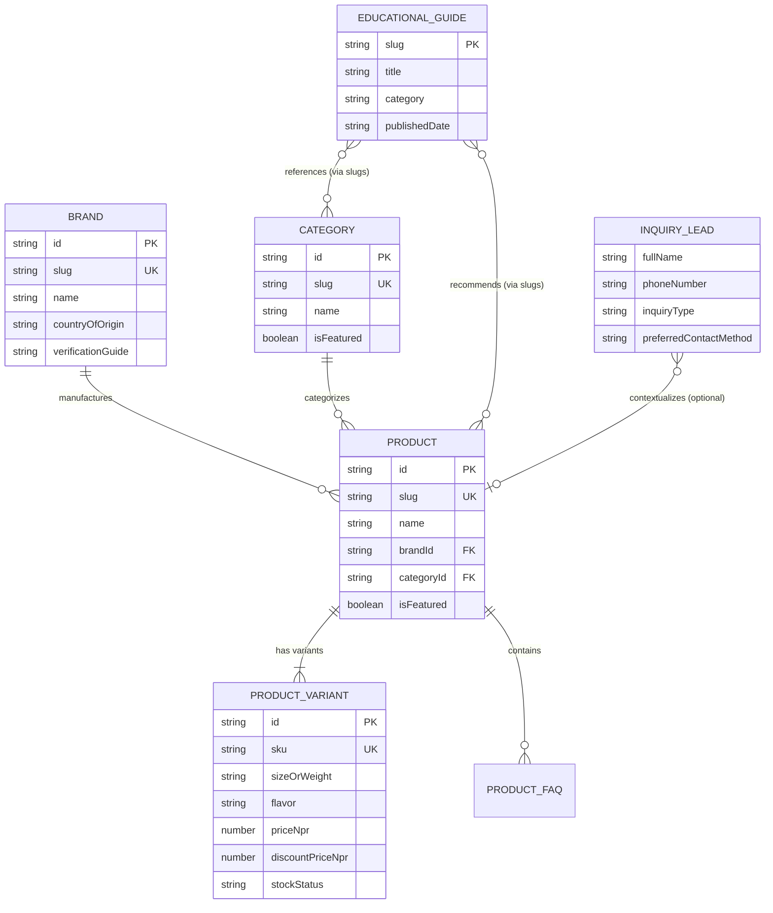

# MUSCLEWORKS SUPPLEMENTS — CANONICAL DATA MODELS & SCHEMAS

**Document:** `data-models.md`  
**Purpose:** Canonical data definitions, Zod validation schemas, and TypeScript interfaces for all AI coding agents  
**Status:** Frozen & Approved for V1  
**Single Source of Truth:** `src/types/` and `src/lib/validations/`  
**Related Docs:** `project-overview.md`, `project-tech-stacks.md`, `project-architecture.md`, `progress-tracker.md`  

---

## 1. DATA MODELING PRINCIPLES & CONVENTIONS

1. **Zero Runtime Drift (Zod-First Type Safety):** All TypeScript interfaces are derived directly from canonical Zod schemas using `z.infer<typeof Schema>`. No standalone, un-synced interface definitions are permitted.
2. **Currency Standard:** All prices are positive integers/numbers denominated strictly in **NPR (Nepalese Rupees)**. No floating-point rounding errors or mixed currency representations.
3. **Identifier & Slug Standards:**
   - Slugs must follow lowercase kebab-case format: `^[a-z0-9]+(?:-[a-z0-9]+)*$` (e.g., `gold-standard-100-whey`, `optimum-nutrition`, `protein-powder`).
   - SKUs must follow uppercase alphanumeric format: `^[A-Z0-9_-]{3,30}$` (e.g., `ON-WHEY-5LB-CHOC`).
4. **Authenticity & Integrity Metadata:** Trust fields are first-class citizens in every product and brand record to support authenticity verification without fabricating unsubstantiated claims.
5. **Security & Anti-Bot Defense:** All public inquiry payloads enforce honeypot field checks (`hp_field`) and submission timing traps (`_form_loaded_at`).



---

## 2. COMMON & SHARED TYPES

### 2.1 SEO & Meta Schema

```typescript
import { z } from 'zod';

export const SEOMetadataSchema = z.object({
  metaTitle: z.string().min(10).max(70),
  metaDescription: z.string().min(50).max(160),
  keywords: z.array(z.string()).default([]),
  canonicalUrl: z.string().url().optional(),
  ogImage: z.string().optional(),
});

export type SEOMetadata = z.infer<typeof SEOMetadataSchema>;
```

### 2.2 FAQ Item Schema

```typescript
export const FAQItemSchema = z.object({
  question: z.string().min(5).max(200),
  answer: z.string().min(10).max(1000),
});

export type FAQItem = z.infer<typeof FAQItemSchema>;
```

### 2.3 Image Asset Schema

```typescript
export const ImageAssetSchema = z.object({
  url: z.string().min(1),
  alt: z.string().min(3).max(150),
  width: z.number().int().positive().optional(),
  height: z.number().int().positive().optional(),
  isPrimary: z.boolean().default(false),
});

export type ImageAsset = z.infer<typeof ImageAssetSchema>;
```

---

## 3. PRODUCT & PRODUCT VARIANT DATA MODELS

### 3.1 Enums

```typescript
export const StockStatusEnum = z.enum([
  'in_stock',
  'out_of_stock',
  'low_stock',
  'pre_order',
]);

export type StockStatus = z.infer<typeof StockStatusEnum>;

export const ProductBadgeEnum = z.enum([
  'bestseller',
  'new_arrival',
  'trending',
  'featured',
  'authenticity_guaranteed',
  'limited_deal',
]);

export type ProductBadge = z.infer<typeof ProductBadgeEnum>;
```

### 3.2 Nutrition Facts & Authenticity Schemas

```typescript
export const NutritionFactItemSchema = z.object({
  name: z.string().min(1), // e.g. "Protein", "BCAA", "Total Fat"
  amountPerServing: z.string().min(1), // e.g. "24g", "5.5g", "1.5g"
  dailyValuePercentage: z.string().optional(), // e.g. "48%", "N/A"
});

export const NutritionFactsSchema = z.object({
  servingSize: z.string().min(1), // e.g. "1 Scoop (30.4g)"
  servingsPerContainer: z.number().positive(), // e.g. 74
  caloriesPerServing: z.number().nonnegative().optional(), // e.g. 120
  proteinGrams: z.number().nonnegative().optional(), // e.g. 24
  carbsGrams: z.number().nonnegative().optional(), // e.g. 3
  fatGrams: z.number().nonnegative().optional(), // e.g. 1.5
  bcaaGrams: z.number().nonnegative().optional(), // e.g. 5.5
  items: z.array(NutritionFactItemSchema).default([]),
});

export type NutritionFacts = z.infer<typeof NutritionFactsSchema>;

export const AuthenticityMetadataSchema = z.object({
  isAuthenticGuarantee: z.boolean().default(true),
  importerOrSource: z.string().min(2), // e.g. "Official Authorized Nepal Importer"
  verificationMethod: z.string().min(5), // e.g. "Scratch-off QR Code / Hologram Seal"
  hologramDescription: z.string().optional(), // e.g. "Look for the gold tamper-evident security seal on the tub cap."
  batchTestingNote: z.string().optional(), // e.g. "Informed-Choice certified / Third-party lab tested."
});

export type AuthenticityMetadata = z.infer<typeof AuthenticityMetadataSchema>;
```

### 3.3 Product Variant Schema

```typescript
export const ProductVariantSchema = z.object({
  id: z.string().min(1), // e.g. "var_on_whey_5lb_choc"
  sku: z.string().regex(/^[A-Z0-9_-]{3,30}$/, 'Invalid SKU format'), // e.g. "ON-WHEY-5LB-CHOC"
  sizeOrWeight: z.string().min(1), // e.g. "5 lbs (2.27 kg)", "60 Capsules", "300g"
  flavor: z.string().default('Unflavored'), // e.g. "Double Rich Chocolate", "Vanilla Ice Cream", "Unflavored"
  priceNpr: z.number().int().positive('Price must be a positive integer in NPR'),
  discountPriceNpr: z.number().int().positive().optional(),
  stockStatus: StockStatusEnum.default('in_stock'),
  image: ImageAssetSchema.optional(), // Optional variant-specific packshot
});

export type ProductVariant = z.infer<typeof ProductVariantSchema>;
```

### 3.4 Top-Level Product Schema

```typescript
export const ProductSchema = z.object({
  id: z.string().min(1), // e.g. "prod_on_gold_standard_whey"
  slug: z.string().regex(/^[a-z0-9]+(?:-[a-z0-9]+)*$/, 'Invalid URL slug format'), // e.g. "gold-standard-100-whey"
  name: z.string().min(2).max(120), // e.g. "Gold Standard 100% Whey Protein"
  brandId: z.string().min(1), // references Brand.id
  categoryId: z.string().min(1), // references Category.id
  shortDescription: z.string().min(20).max(300),
  fullDescription: z.string().min(50),
  highlights: z.array(z.string().min(3)).min(1).max(10), // Bullet points
  ingredients: z.string().min(5),
  directions: z.string().min(5), // Usage instructions / timing
  nutritionFacts: NutritionFactsSchema,
  authenticity: AuthenticityMetadataSchema,
  images: z.array(ImageAssetSchema).min(1, 'At least one product image is required'),
  defaultVariantId: z.string().min(1),
  variants: z.array(ProductVariantSchema).min(1, 'Product must have at least one variant'),
  tags: z.array(z.string()).default([]), // e.g. ["muscle-building", "post-workout", "isolate-blend"]
  badges: z.array(ProductBadgeEnum).default([]),
  isFeatured: z.boolean().default(false),
  faqs: z.array(FAQItemSchema).default([]),
  seo: SEOMetadataSchema,
  createdAt: z.string().datetime().optional(),
  updatedAt: z.string().datetime().optional(),
}).refine(
  (data) => data.variants.some((v) => v.id === data.defaultVariantId),
  {
    message: 'defaultVariantId must match an existing variant id in the variants array',
    path: ['defaultVariantId'],
  }
);

export type Product = z.infer<typeof ProductSchema>;
```

---

## 4. CATEGORY & BRAND TAXONOMY MODELS

### 4.1 Category Schema

```typescript
export const CategorySchema = z.object({
  id: z.string().min(1), // e.g. "cat_protein"
  slug: z.string().regex(/^[a-z0-9]+(?:-[a-z0-9]+)*$/, 'Invalid URL slug format'), // e.g. "protein-powders"
  name: z.string().min(2).max(60), // e.g. "Protein Powders"
  shortDescription: z.string().min(20).max(250),
  longDescription: z.string().min(50).optional(),
  icon: z.string().optional(), // Lucide icon identifier (e.g. "Dumbbell", "Zap", "Flame")
  heroImage: ImageAssetSchema.optional(),
  isFeatured: z.boolean().default(false),
  displayOrder: z.number().int().nonnegative().default(0),
  faqs: z.array(FAQItemSchema).default([]),
  seo: SEOMetadataSchema,
});

export type Category = z.infer<typeof CategorySchema>;
```

### 4.2 Brand Schema

```typescript
export const BrandSchema = z.object({
  id: z.string().min(1), // e.g. "brand_optimum_nutrition"
  slug: z.string().regex(/^[a-z0-9]+(?:-[a-z0-9]+)*$/, 'Invalid URL slug format'), // e.g. "optimum-nutrition"
  name: z.string().min(2).max(60), // e.g. "Optimum Nutrition (ON)"
  logo: ImageAssetSchema,
  countryOfOrigin: z.string().min(2), // e.g. "United States (USA)", "United Kingdom (UK)", "Nepal"
  officialDistributorInfo: z.string().min(5), // e.g. "Sourced directly via authorized national distributors."
  verificationGuide: z.string().min(10), // e.g. "Authentic ON tubs in Nepal feature a scratch-and-verify security code."
  description: z.string().min(30).max(1000),
  websiteUrl: z.string().url().optional(),
  isFeatured: z.boolean().default(false),
  seo: SEOMetadataSchema,
});

export type Brand = z.infer<typeof BrandSchema>;
```

---

## 5. INQUIRY & LEAD FORM SCHEMAS

### 5.1 Validation Rules & Regular Expressions

- **Nepal Phone Regex:** `^(?:\+977[- ]?)?(?:98\d{8}|97\d{8}|01[- ]?\d{6,7})$`
  - Matches +977-98XXXXXXXX (Ncell / NTC GSM)
  - Matches 98XXXXXXXX / 97XXXXXXXX
  - Matches 01-XXXXXXX (Kathmandu landline)

### 5.2 Form Schemas

```typescript
export const NepalPhoneRegex = /^(?:\+977[- ]?)?(?:98\d{8}|97\d{8}|01[- ]?\d{6,7})$/;

export const InquiryTypeEnum = z.enum([
  'general',
  'product_inquiry',
  'bulk_order',
  'delivery_status',
]);

export type InquiryType = z.infer<typeof InquiryTypeEnum>;

export const PreferredContactMethodEnum = z.enum([
  'whatsapp',
  'phone',
  'email',
]);

export type PreferredContactMethod = z.infer<typeof PreferredContactMethodEnum>;

export const InquiryProductContextSchema = z.object({
  productId: z.string().min(1),
  productName: z.string().min(1),
  productSlug: z.string().min(1),
  variantSku: z.string().optional(),
  variantLabel: z.string().optional(), // e.g. "5 lbs / Chocolate"
  priceNpr: z.number().int().positive().optional(),
});

export type InquiryProductContext = z.infer<typeof InquiryProductContextSchema>;

// Client-side Form Validation Schema (React Hook Form)
export const InquiryFormClientSchema = z.object({
  fullName: z.string().trim().min(2, 'Name must be at least 2 characters').max(80, 'Name cannot exceed 80 characters'),
  phoneNumber: z.string().trim().regex(NepalPhoneRegex, 'Please enter a valid Nepal phone number (e.g. 98XXXXXXXX or +977 98XXXXXXXX)'),
  email: z.string().trim().email('Please enter a valid email address').optional().or(z.literal('')),
  inquiryType: InquiryTypeEnum.default('general'),
  message: z.string().trim().min(10, 'Message must be at least 10 characters').max(1000, 'Message cannot exceed 1000 characters'),
  preferredContactMethod: PreferredContactMethodEnum.default('whatsapp'),
  deliveryCity: z.string().trim().max(60).optional(),
  productContext: InquiryProductContextSchema.optional(),
  hp_field: z.string().max(0, 'Bot submission detected').default(''), // Honeypot
  _form_loaded_at: z.number().int().positive(), // Submission time check
});

export type InquiryFormClientValues = z.infer<typeof InquiryFormClientSchema>;

// Server-side Processing Payload
export const InquiryServerPayloadSchema = InquiryFormClientSchema.extend({
  clientIp: z.string().optional(),
  userAgent: z.string().optional(),
  submittedAt: z.string().datetime(),
});

export type InquiryServerPayload = z.infer<typeof InquiryServerPayloadSchema>;

// Server Action Response Schema
export const ActionResponseSchema = z.object({
  success: z.boolean(),
  message: z.string(),
  errors: z.record(z.array(z.string())).optional(),
});

export type ActionResponse = z.infer<typeof ActionResponseSchema>;
```

---

## 6. STORE INFORMATION & LOCATION SCHEMA

```typescript
export const DayOfWeekEnum = z.enum([
  'sunday',
  'monday',
  'tuesday',
  'wednesday',
  'thursday',
  'friday',
  'saturday',
]);

export type DayOfWeek = z.infer<typeof DayOfWeekEnum>;

export const OpeningHourItemSchema = z.object({
  day: DayOfWeekEnum,
  label: z.string(), // e.g. "Sunday"
  opens: z.string(), // e.g. "10:00 AM" or "10:00"
  closes: z.string(), // e.g. "09:00 PM" or "21:00"
  isClosed: z.boolean().default(false),
  note: z.string().optional(), // For Saturday: "Not yet specified — please contact store before visiting."
});

export const GeoCoordinatesSchema = z.object({
  latitude: z.number().min(-90).max(90),
  longitude: z.number().min(-180).max(180),
  googleMapsPlaceUrl: z.string().url(),
  googleMapsEmbedUrl: z.string().url(),
});

export const DeliveryZonePolicySchema = z.object({
  coverage: z.literal('Nationwide Nepal'),
  primaryZones: z.array(z.string()), // e.g. ["Kathmandu Valley (Same-Day / Next-Day)", "Outside Valley (2-4 Business Days)"]
  deliveryFeeNotes: z.string(), // "Delivery charges apply based on weight and destination."
  freeDeliveryThresholdNpr: z.number().int().positive().optional(),
});

export const StoreContactMatrixSchema = z.object({
  primaryPhone: z.string(), // e.g. "+977-98XXXXXXXX"
  secondaryPhone: z.string().optional(),
  whatsappNumber: z.string(), // e.g. "97798XXXXXXXX" (URL compatible)
  whatsappDisplay: z.string(), // e.g. "+977 98XXXXXXXX"
  storeEmail: z.string().email(),
  supportEmail: z.string().email().optional(),
});

export const StoreInfoSchema = z.object({
  name: z.literal('MUSCLEWORKS SUPPLEMENTS'),
  legalName: z.string().default('MUSCLEWORKS SUPPLEMENTS'),
  tagline: z.string(),
  establishedYear: z.literal(2026),
  address: z.object({
    streetAddress: z.string(), // "Golfutar"
    area: z.string(), // "Golfutar"
    municipality: z.string(), // "Budha-Nilkantha"
    city: z.string(), // "Kathmandu"
    district: z.string(), // "Kathmandu"
    province: z.string(), // "Bagmati Province"
    postalCode: z.literal('44500'),
    country: z.literal('Nepal'),
    landmark: z.string().optional(),
  }),
  coordinates: GeoCoordinatesSchema,
  openingHours: z.array(OpeningHourItemSchema),
  contacts: StoreContactMatrixSchema,
  deliveryPolicy: DeliveryZonePolicySchema,
  socialLinks: z.object({
    instagram: z.string().url().optional(),
    tiktok: z.string().url().optional(),
    facebook: z.string().url().optional(),
    youtube: z.string().url().optional(),
  }),
});

export type StoreInfo = z.infer<typeof StoreInfoSchema>;
```

---

## 7. EDUCATIONAL GUIDES & MDX FRONTMATTER SCHEMA

```typescript
export const GuideCategoryEnum = z.enum([
  'buying_guide',
  'supplement_education',
  'authenticity_guide',
  'beginner_fitness',
  'nutrition_science',
]);

export type GuideCategory = z.infer<typeof GuideCategoryEnum>;

export const GuideAuthorSchema = z.object({
  name: z.string().min(2),
  role: z.string().min(2), // e.g. "Certified Sports Nutritionist", "MUSCLEWORKS Editorial"
  avatar: z.string().optional(),
  bio: z.string().optional(),
});

export type GuideAuthor = z.infer<typeof GuideAuthorSchema>;

export const GuideFrontmatterSchema = z.object({
  title: z.string().min(10).max(120),
  slug: z.string().regex(/^[a-z0-9]+(?:-[a-z0-9]+)*$/, 'Invalid URL slug format'),
  excerpt: z.string().min(30).max(300),
  category: GuideCategoryEnum,
  coverImage: ImageAssetSchema,
  author: GuideAuthorSchema,
  publishedDate: z.string().regex(/^\d{4}-\d{2}-\d{2}$/, 'Date must be in YYYY-MM-DD format'),
  updatedDate: z.string().regex(/^\d{4}-\d{2}-\d{2}$/, 'Date must be in YYYY-MM-DD format').optional(),
  readingTimeMinutes: z.number().int().positive().default(5),
  isFeatured: z.boolean().default(false),
  relatedProductSlugs: z.array(z.string()).default([]), // Links guide directly to product purchasing CTAs
  relatedCategorySlugs: z.array(z.string()).default([]),
  faqs: z.array(FAQItemSchema).default([]),
  seo: SEOMetadataSchema,
});

export type GuideFrontmatter = z.infer<typeof GuideFrontmatterSchema>;
```

---

## 8. SUMMARY TYPE EXPORT DIRECTORY MAPPING

All schemas and types defined in this document must be organized in the project as follows:

| Source File | Exports |
|---|---|
| `src/types/common.ts` | `SEOMetadata`, `FAQItem`, `ImageAsset`, `ActionResponse` |
| `src/types/product.ts` | `Product`, `ProductVariant`, `NutritionFacts`, `AuthenticityMetadata`, `StockStatus`, `ProductBadge` |
| `src/types/taxonomy.ts` | `Category`, `Brand` |
| `src/types/inquiry.ts` | `InquiryFormClientValues`, `InquiryServerPayload`, `InquiryType`, `PreferredContactMethod` |
| `src/types/store.ts` | `StoreInfo`, `DayOfWeek`, `OpeningHourItem`, `GeoCoordinates` |
| `src/types/guide.ts` | `GuideFrontmatter`, `GuideCategory`, `GuideAuthor` |
| `src/lib/validations/product.ts` | `ProductSchema`, `ProductVariantSchema`, `NutritionFactsSchema`, `AuthenticityMetadataSchema` |
| `src/lib/validations/taxonomy.ts` | `CategorySchema`, `BrandSchema` |
| `src/lib/validations/inquiry.ts` | `InquiryFormClientSchema`, `InquiryServerPayloadSchema`, `NepalPhoneRegex` |
| `src/lib/validations/store.ts` | `StoreInfoSchema`, `OpeningHourItemSchema` |
| `src/lib/validations/guide.ts` | `GuideFrontmatterSchema` |

---

## 9. VALIDATION & COMPLIANCE CHECKLIST FOR CODING AGENTS

- [x] Every schema uses strict typing with comprehensive bounds (`.min()`, `.max()`, regex).
- [x] All prices are integer values in NPR.
- [x] Currency and stock statuses are strongly enumerated.
- [x] Nepal phone number validation is explicitly defined and tested against mobile/landline patterns.
- [x] Saturday opening hours are strictly preserved as unspecified per client instructions (`project-overview.md`).
- [x] Honeypot and timing trap fields are integrated into the inquiry lead schema.
- [x] Educational guide frontmatter connects directly to product and category catalogs via slugs.
