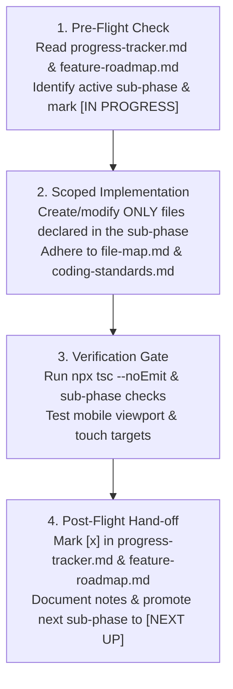
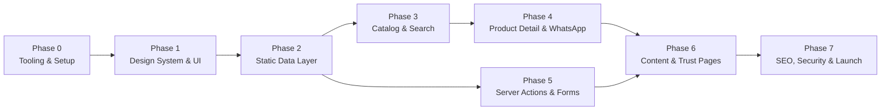

# Feature Roadmap & Phase-by-Phase Execution Blueprint

> **Canonical Specification Document**  
> **Target Project:** MuscleWorks Nepal E-Commerce Web Application  
> **Framework:** Next.js 16.3.0 App Router · React 19.2.8 · TypeScript 5 · Tailwind CSS v4  
> **Status:** Canonical Blueprint — Ready for Execution

---

## 1. Execution Philosophy & Agent Operating Rules

To prevent context drift, hallucinations, regressions, or partial implementations across agent sessions, every AI coding assistant and engineer working on this repository **MUST STRICTLY ADHERE** to the following mandatory execution rules:

### Rule 1: One Atomic Sub-Phase Per Turn
- Never attempt to implement multiple sub-phases in a single turn.
- Each sub-phase is intentionally sized to 2–4 related files with explicit type contracts, scoped styling, and self-contained verification.
- Complete the sub-phase, verify it thoroughly, update the progress trackers, and stop to hand off.

### Rule 2: Mandatory 4-Step Progress Synchronization Protocol
Before writing any code and immediately after completing any sub-phase, follow this 4-step state transition:



1. **Pre-Flight Check:**
   - Inspect [progress-tracker.md](file:///c:/nooridigital_assets/my-projects/muscleworks/context/progress-tracker.md) and this roadmap.
   - Identify the immediate next unchecked sub-phase.
   - Mark the sub-phase as `[IN PROGRESS]` in [progress-tracker.md](file:///c:/nooridigital_assets/my-projects/muscleworks/context/progress-tracker.md).
   - Announce the active sub-phase ID, file targets, and verification criteria to the user before editing files.
2. **Scoped Implementation:**
   - Create or modify **ONLY** the exact files specified for that atomic sub-phase.
   - Follow all canonical contracts in [file-map.md](file:///c:/nooridigital_assets/my-projects/muscleworks/context/file-map.md), [data-models.md](file:///c:/nooridigital_assets/my-projects/muscleworks/context/data-models.md), and [coding-standards.md](file:///c:/nooridigital_assets/my-projects/muscleworks/context/coding-standards.md).
3. **Verification Gate:**
   - Run `npx tsc --noEmit` to verify zero TypeScript errors.
   - Verify mobile responsiveness (360px, 390px, 768px, 1280px) and minimum touch targets (≥44x44px, ≥48x48px CTAs).
   - Resolve any lint or compilation errors before proceeding.
4. **Post-Flight Hand-off:**
   - Check off `[x]` the completed sub-phase in both [feature-roadmap.md](file:///c:/nooridigital_assets/my-projects/muscleworks/context/feature-roadmap.md) and [progress-tracker.md](file:///c:/nooridigital_assets/my-projects/muscleworks/context/progress-tracker.md).
   - Update `Session Notes` in [progress-tracker.md](file:///c:/nooridigital_assets/my-projects/muscleworks/context/progress-tracker.md) with key changes.
   - Mark the next sub-phase as `[NEXT UP]` and deliver a concise status summary.

### Rule 3: Dual-Tier Quality Standards
- **Sub-Phase Level:** Zero TypeScript errors (`npx tsc --noEmit`), clean imports, mobile touch compliance, and correct component exports.
- **Major Phase Gate:** Full static generation verification (`npm run build`), zero dynamic SSR bailouts, responsive layout verification, and Server Action security assertions.

---

## 2. Milestone Summary & Dependency Graph



| Phase | Milestone Name | Estimated Sub-Phases | Critical Path Dependencies | Primary Output Artifacts |
| :--- | :--- | :--- | :--- | :--- |
| **Phase 0** | Project Setup, Tooling & Infrastructure | 4 Sub-Phases (0.1–0.4) | None | Next.js 16 setup, TS config, Tailwind v4 theme, root layout |
| **Phase 1** | Core Design System & Shared UI Primitives | 5 Sub-Phases (1.1–1.5) | Phase 0 | Radix primitives, buttons, navigation, header, footer, mobile bar |
| **Phase 2** | Static Datasets & Typed Data Access Layer | 4 Sub-Phases (2.1–2.4) | Phase 0 | Zod schemas, JSON datasets (products/stores/faqs), data accessors |
| **Phase 3** | Catalog, Filtering & In-Memory Fuzzy Search | 4 Sub-Phases (3.1–3.4) | Phase 1, Phase 2 | Product cards, Fuse.js search, filter sheet, `/products`, archive hubs |
| **Phase 4** | Product Detail & Dynamic WhatsApp Engine | 4 Sub-Phases (4.1–4.4) | Phase 2, Phase 3 | Gallery, variant selectors, WhatsApp URL generator, `/products/[slug]` |
| **Phase 5** | Lead Forms, Server Actions & Notifications | 5 Sub-Phases (5.1–5.5) | Phase 1, Phase 2 | Upstash rate limit, Resend emails, Telegram bot, `/contact`, `/stores` |
| **Phase 6** | Informational, Trust, Education & Legal Pages | 5 Sub-Phases (6.1–6.5) | Phase 1, Phase 3, Phase 4 | Homepage `/`, `/about`, `/authenticity`, MDX `/guides`, legal pages |
| **Phase 7** | SEO, Security, Performance & Launch Hardening | 4 Sub-Phases (7.1–7.4) | Phase 0–6 | XML sitemap, JSON-LD schemas, CSP headers, Lighthouse 95+ audit |

---

## 3. Detailed Phase-by-Phase Execution Blueprint

---

### Phase 0: Project Setup, Tooling & Package Infrastructure

#### Sub-Phase 0.1: Project Scaffold & Dependency Manifest
- [x] **Status:** Completed
- **Target Files:**
  - `package.json` [MODIFY]
  - `tsconfig.json` [MODIFY]
  - `next.config.ts` [MODIFY]
  - `.gitignore` [MODIFY]
- **Purpose & Scope:**
  - Verify and lock Next.js 16.3.0, React 19.2.8, TypeScript 5.x, Tailwind CSS v4, Lucide React, Radix UI primitives, Zod, and Resend dependencies.
  - Configure strict TypeScript compilation with standardized path aliases (`@/*`, `@/data/*`, `@/content/*`).
  - Configure `next.config.ts` with image optimization domains (Unsplash, Cloudinary, local assets), SVG support, and React compiler optimizations.
- **Verification Checklist:**
  - [x] `npm install` executes cleanly with zero peer dependency conflicts.
  - [x] `npx tsc --noEmit` resolves path aliases without errors.

#### Sub-Phase 0.2: Styling System & Tailwind CSS v4 Theme Engine
- [x] **Status:** Completed
- **Target Files:**
  - `src/app/globals.css` [NEW]
  - `postcss.config.mjs` [NEW]
- **Purpose & Scope:**
  - Configure Tailwind CSS v4 `@theme` block in `src/app/globals.css` with Minimal Premium Modern Luxury palette (Jet Black `#0B0B0B`, Pure White `#FFFFFF`, Metallic Gold `#D4AF37`, Silver Gray `#F5F5F5`, Neutral Gray `#2C2C2C`/`#E5E5E5`).
  - Define custom typography scale using `Inter` / `Plus Jakarta Sans` and `Outfit` font tokens.
  - Add smooth scrolling, accessible focus ring utility styles, custom scrollbar styling, and touch-callout resets.
- **Verification Checklist:**
  - [x] Tailwind `@theme` variables compile without syntax warnings.
  - [x] Background and foreground CSS variables render expected minimal premium luxury aesthetic.

#### Sub-Phase 0.3: Core Utility Layer & Type Foundations
- [x] **Status:** Completed
- **Target Files:**
  - `src/lib/utils.ts` [NEW]
  - `src/lib/constants.ts` [NEW]
  - `src/types/index.ts` [NEW]
  - `src/types/actions.ts` [NEW]
- **Purpose & Scope:**
  - Implement standard `cn()` helper combining `clsx` and `tailwind-merge`.
  - Define brand constants: store phone, official WhatsApp order number, store physical address at Golfutar, Budha-Nilkantha, Kathmandu (44500), opening hours, and canonical social media links.
  - Define global shared TypeScript types and utility helpers (currency formatter `formatNprPrice`, discount calculator `calculateDiscountPercentage`).
- **Verification Checklist:**
  - [x] `npx tsc --noEmit` passes with zero errors.
  - [x] `formatNprPrice(5500)` returns `"NPR 5,500"`.

#### Sub-Phase 0.4: Next.js 16 App Root Layout & Font Engine
- [x] **Status:** Completed
- **Target Files:**
  - `src/app/layout.tsx` [MODIFY]
  - `src/app/not-found.tsx` [NEW]
  - `src/app/error.tsx` [NEW]
  - `src/app/global-error.tsx` [NEW]
- **Purpose & Scope:**
  - Setup Google Fonts `Outfit` (headings) and `Plus Jakarta Sans` (body) via `next/font/google` with variable font optimization and `display: swap`.
  - Build root HTML layout structure with viewport meta, light color scheme, and global toast container.
  - Build responsive 404 Not Found page with supplement-themed graphic and recovery CTA buttons.
  - Build global Error Boundary (`error.tsx`) and root layout fallback (`global-error.tsx`) with reset trigger.
- **Verification Checklist:**
  - [x] Root layout renders with fonts applied to `<html>` and `<body>`.
  - [x] `/not-found` route displays branded 404 shell and navigation back to catalog.

---

### Phase 1: Core Design System & Shared UI Primitives

#### Sub-Phase 1.1: Core Action & Feedback Primitives
- [x] **Status:** Completed
- **Target Files:**
  - `src/components/ui/button.tsx` [NEW]
  - `src/components/ui/badge.tsx` [NEW]
  - `src/components/ui/separator.tsx` [NEW]
  - `src/components/ui/skeleton.tsx` [NEW]
- **Purpose & Scope:**
  - Build CVA-based Button component with variants (`default` Jet Black, `whatsapp` Jet Black & Metallic Gold border, `gold` Metallic Gold, `secondary`, `outline`, `ghost`, `destructive`, `link`) and sizes (`sm`, `default` 44px, `lg` 48px, `xl` 56px, `icon` 44px). Enforce minimum touch target heights (`h-11` or `h-12` on mobile).
  - Build Badge component with variants (`authentic` Metallic Gold tint, `discount` Jet Black, `stock` Metallic Gold, `category` Silver Gray, `default`, `outline`).
  - Build accessible Separator and Skeleton loader primitives.
- **Verification Checklist:**
  - [x] `npx tsc --noEmit` passes cleanly.
  - [x] All button variants satisfy min touch target ≥44px (≥48px for CTA sizes).

#### Sub-Phase 1.2: Form Input & Text Primitives
- [x] **Status:** Completed
- **Target Files:**
  - `src/components/ui/input.tsx` [NEW]
  - `src/components/ui/textarea.tsx` [NEW]
  - `src/components/ui/select.tsx` [NEW]
  - `src/components/ui/card.tsx` [NEW]
- **Purpose & Scope:**
  - Create accessible dark-themed Input and Textarea components with error states and focus-visible rings.
  - Build accessible Radix Select dropdown component family.
  - Build Card container family (`Card`, `CardHeader`, `CardTitle`, `CardDescription`, `CardContent`, `CardFooter`) with subtle obsidian border and hover elevation.
- **Verification Checklist:**
  - [x] `npx tsc --noEmit` passes cleanly.
  - [x] Inputs have `16px` (`text-base sm:text-sm`) font size on mobile to prevent iOS Safari auto-zoom.

#### Sub-Phase 1.3: Overlay & Dialog Primitives (Radix Headless)
- [x] **Status:** Completed
- **Target Files:**
  - `src/components/ui/dialog.tsx` [NEW]
  - `src/components/ui/sheet.tsx` [NEW]
  - `src/components/ui/toast.tsx` [NEW]
  - `src/components/ui/breadcrumb.tsx` [NEW]
- **Purpose & Scope:**
  - Implement Radix UI headless Dialog with accessible modal overlay, backdrop blur, and focus trap.
  - Implement Radix UI Sheet primitive (slide-over panel from left/right/bottom) for mobile navigation drawers and catalog filter panels.
  - Wrap Sonner toast engine with branded styling (crimson error, emerald success, gold info).
  - Implement accessible Breadcrumb navigation list with Chevron separators.
- **Verification Checklist:**
  - [x] `npx tsc --noEmit` passes cleanly.
  - [x] Dialog and Sheet animate smoothly and support `Escape` key close.

#### Sub-Phase 1.4: Global Navigation Shell & Header
- [x] **Status:** Completed
- **Target Files:**
  - `src/components/layout/header.tsx` [NEW]
  - `src/components/layout/navbar.tsx` [NEW]
  - `src/components/layout/mobile-nav.tsx` [NEW]
  - `src/app/layout.tsx` [MODIFY]
- **Purpose & Scope:**
  - Build sticky top Header with MuscleWorks logo, desktop navigation links (Proteins, Creatine, Gainers, Brands, Stores, Authenticity, Guides), search trigger button, and WhatsApp fast-order CTA.
  - Build slide-over mobile drawer (`mobile-nav.tsx`) featuring categorized supplement links, physical store locations, phone contact triggers, and social links.
  - Include mobile hamburger toggle with accessible `aria-expanded` and `aria-label`.
- **Verification Checklist:**
  - [x] Mobile hamburger toggle opens slide-over drawer smoothly on <768px viewports.
  - [x] Header remains sticky on scroll with backdrop blur styling.

#### Sub-Phase 1.5: Global Footer, Floating WhatsApp & Mobile Action Bar
- [x] **Status:** Complete
- **Target Files:**
  - `src/components/layout/footer.tsx` [NEW]
  - `src/components/layout/sticky-cta-bar.tsx` [NEW]
  - `src/components/layout/whatsapp-floating-button.tsx` [NEW]
- **Purpose & Scope:**
  - Build rich Footer featuring brand manifesto, category quick-links, store address (Golfutar, Budha-Nilkantha, Kathmandu), opening hours, WhatsApp direct order link, authentic import guarantee badge, payment/delivery notices, and copyright.
  - Build floating WhatsApp speed dial button (bottom-right desktop/mobile) with pulsing online badge.
  - Build sticky mobile bottom CTA bar (`sticky-cta-bar.tsx`) with conditional rendering (hides on desktop `md:hidden`, shows on product detail and catalog with conversion actions).
- **Verification Checklist:**
  - [x] `npx tsc --noEmit` passes cleanly.
  - [x] Sticky CTA bar appears on mobile viewports (<768px) and hides on desktop (≥768px).

---

### Phase 2: Static Datasets & Typed Data Access Layer

#### Sub-Phase 2.1: Zod Schemas & Domain Type Definitions
- [ ] **Status:** Unchecked
- **Target Files:**
  - `src/lib/validations/common.ts` [NEW]
  - `src/lib/validations/product.ts` [NEW]
  - `src/lib/validations/inquiry.ts` [NEW]
  - `src/lib/validations/store.ts` [NEW]
- **Purpose & Scope:**
  - Define Zod schemas and TypeScript types for `Product`, `ProductVariant`, `NutritionFacts`, `Category`, `Brand`, `StoreInfo`, `InquiryFormClientValues`, `InquiryServerPayload`, and `ActionResult` matching [data-models.md](context/data-models.md).
  - Include Nepal phone number regex validation (`/^(?:\+977[- ]?)?(?:98\d{8}|97\d{8}|01\d{6,7})$/`).
- **Verification Checklist:**
  - [ ] `npx tsc --noEmit` passes cleanly.
  - [ ] Zod schema `.parse()` tests validate mock data objects correctly.

#### Sub-Phase 2.2: Canonical JSON Datasets (Products, Categories & Brands)
- [ ] **Status:** Unchecked
- **Target Files:**
  - `data/products.json` [NEW]
  - `data/categories.json` [NEW]
  - `data/brands.json` [NEW]
- **Purpose & Scope:**
  - Author comprehensive, realistic dataset of 15+ authentic supplements available in Nepal (Optimum Nutrition Gold Standard Whey, MuscleTech NitroTech, Dymatize ISO 100, MyProtein Impact Whey, Kevin Levrone Gold Creatine, Rule 1 R1 Protein, Muscletech Platinum Creatine, ON Serious Mass, Labrada Muscle Mass Gainer, C4 Original Pre-Workout, Animal Pak Multivitamin, MusclePharm Fish Oil, Xtend BCAA).
  - Provide complete variants (flavors: Double Rich Chocolate, Vanilla Ice Cream, Strawberry, Unflavored; sizes: 2 lbs, 5 lbs, 250g, 300g, 60 servings), NPR pricing with genuine market values, in-stock status, nutrition facts, and authentic importer sticker verification details.
  - Author categories (`proteins`, `creatine`, `mass-gainers`, `pre-workout`, `vitamins-health`, `amino-bcaa`) and brands.
- **Verification Checklist:**
  - [ ] JSON files parse without syntax errors.
  - [ ] All products pass `ProductSchema.array().parse(data)` validation without errors.

#### Sub-Phase 2.3: Supplementary Datasets (Store Info & Comprehensive FAQs)
- [ ] **Status:** Unchecked
- **Target Files:**
  - `data/store-info.json` [NEW]
  - `data/faqs.json` [NEW]
- **Purpose & Scope:**
  - Author store data for the single physical retail outlet in Golfutar, Budha-Nilkantha, Kathmandu (44500) with coordinates, phone, opening hours (Sun-Fri 10AM-9PM), landmarks, and parking availability.
  - Author comprehensive supplement FAQ database covering authenticity checks in Nepal, delivery timelines across Kathmandu Valley and outside-valley cities, and payment methods (Cash/Fonepay on delivery).
- **Verification Checklist:**
  - [ ] Datasets validate against `StoreInfoSchema` and `FAQItemSchema`.

#### Sub-Phase 2.4: Catalog Data Accessor Layer (Products, Categories & Brands)
- [ ] **Status:** Unchecked
- **Target Files:**
  - `src/lib/data/products.ts` [NEW]
  - `src/lib/data/categories.ts` [NEW]
  - `src/lib/data/brands.ts` [NEW]
- **Purpose & Scope:**
  - Build typed accessor functions (`getProducts()`, `getProductBySlug(slug)`, `getProductsByCategory(categorySlug)`, `getProductsByBrand(brandSlug)`, `getFeaturedProducts()`, `getRelatedProducts(product, limit)`, `getCategories()`, `getCategoryBySlug(slug)`, `getBrands()`, `getBrandBySlug(slug)`).
  - Implement static data caching and in-memory sort/filter operations.
- **Verification Checklist:**
  - [ ] `npx tsc --noEmit` passes cleanly.
  - [ ] `getProductBySlug('optimum-nutrition-gold-standard-100-whey')` returns expected product object.

#### Sub-Phase 2.5: Store, FAQ & Content Accessor Layer
- [ ] **Status:** Unchecked
- **Target Files:**
  - `src/lib/data/store.ts` [NEW]
  - `src/lib/data/faqs.ts` [NEW]
  - `src/lib/data/guides.ts` [NEW]
- **Purpose & Scope:**
  - Build typed accessors for store metadata (`getStoreInfo()`, `getOpeningHours()`, `getDeliveryPolicy()`), FAQ entries (`getFAQs()`, `getFAQsByCategory()`), and MDX educational guide accessors (`getAllGuides()`, `getGuideBySlug()`).
- **Verification Checklist:**
  - [ ] `npx tsc --noEmit` passes cleanly.
  - [ ] `getStoreInfo()` returns valid store metadata for Golfutar location.

---

### Phase 3: Catalog, Filtering & In-Memory Fuzzy Search

#### Sub-Phase 3.1: Product Display Components (Card, Grid & Badges)
- [ ] **Status:** Unchecked
- **Target Files:**
  - `src/components/product/product-card.tsx` [NEW]
  - `src/components/product/product-grid.tsx` [NEW]
  - `src/components/product/product-authenticity-badge.tsx` [NEW]
- **Purpose & Scope:**
  - Build responsive `ProductCard` component featuring Next.js optimized product image, brand tag, product title, NPR price formatting, discount percentage badge, flavor/size variant count indicator, stock badge, and direct WhatsApp quick-inquiry action.
  - Build responsive `ProductGrid` component (2 columns on mobile `<640px`, 3 columns on tablet, 4 columns on desktop).
  - Build 100% Genuine Importer Hologram Badge component.
- **Verification Checklist:**
  - [ ] `npx tsc --noEmit` passes cleanly.
  - [ ] Product card maintains clean layout with no content overflow on 360px viewport.

#### Sub-Phase 3.2: In-Memory Fuzzy Search Engine (Fuse.js)
- [ ] **Status:** Unchecked
- **Target Files:**
  - `src/lib/search.ts` [NEW]
  - `src/components/catalog/search-bar.tsx` [NEW]
  - `src/components/catalog/search-modal.tsx` [NEW]
- **Purpose & Scope:**
  - Configure client-side Fuse.js index searching across product title, brand, category, flavors, and fitness goals with weighted thresholds.
  - Build `SearchBar` component with instant dropdown result preview (thumbnail, title, price, brand).
  - Build full `SearchModal` component with keyboard shortcut trigger (`Cmd+K` / `Ctrl+K`), recent searches, and mobile full-screen view.
- **Verification Checklist:**
  - [ ] `npx tsc --noEmit` passes cleanly.
  - [ ] Typing `"whey"` or `"creatine"` in search bar instantly returns matching products.

#### Sub-Phase 3.3: Desktop Filter Components & Active State
- [ ] **Status:** Unchecked
- **Target Files:**
  - `src/components/catalog/catalog-filters.tsx` [NEW]
  - `src/components/catalog/active-filters.tsx` [NEW]
  - `src/components/catalog/category-chips.tsx` [NEW]
- **Purpose & Scope:**
  - Build multi-facet desktop filter sidebar (Category checkboxes, Goal selectors, Price range slider, In-stock toggle).
  - Implement `ActiveFilters` component with individual removable filter pills and "Clear All" action.
  - Implement `CategoryChips` horizontal quick-filter scroll for catalog headers.
- **Verification Checklist:**
  - [ ] `npx tsc --noEmit` passes cleanly.

#### Sub-Phase 3.4: Mobile Filter Drawer & Brand Facets
- [ ] **Status:** Unchecked
- **Target Files:**
  - `src/components/catalog/mobile-filter-drawer.tsx` [NEW]
  - `src/components/catalog/brand-filter.tsx` [NEW]
- **Purpose & Scope:**
  - Build slide-over `MobileFilterDrawer` using `Sheet` primitive with active filter count badge and sticky "Apply Filters" CTA button.
  - Build `BrandFilter` facet component with search input for quick brand filtering.
  - Sync filter state seamlessly with URL query parameters (`?category=proteins&brand=optimum-nutrition&sort=price-asc`).
- **Verification Checklist:**
  - [ ] `npx tsc --noEmit` passes cleanly.
  - [ ] Mobile filter drawer opens, allows selecting facets, updates URL params, and closes cleanly.

#### Sub-Phase 3.5: Products Catalog Hub Route
- [ ] **Status:** Unchecked
- **Target Files:**
  - `src/app/products/page.tsx` [NEW]
- **Purpose & Scope:**
  - Implement `/products` catalog page with sorting dropdown (Price Low-to-High, Price High-to-Low, Popularity, Newest), responsive sidebar layout, and empty state with reset button.
  - Configure `generateMetadata` for dynamic SEO titles and meta descriptions for the catalog hub.
- **Verification Checklist:**
  - [ ] `npx tsc --noEmit` passes cleanly.
  - [ ] Catalog route renders grid with live URL query filtering.

#### Sub-Phase 3.6: Category & Brand Dynamic Archive Routes
- [ ] **Status:** Unchecked
- **Target Files:**
  - `src/app/categories/page.tsx` [NEW]
  - `src/app/categories/[slug]/page.tsx` [NEW]
  - `src/app/brands/page.tsx` [NEW]
  - `src/app/brands/[slug]/page.tsx` [NEW]
- **Purpose & Scope:**
  - Implement `/categories` index and `/categories/[slug]` landing pages with `generateStaticParams` and SEO metadata.
  - Implement `/brands` index and `/brands/[slug]` landing pages with `generateStaticParams` and SEO metadata.
- **Verification Checklist:**
  - [ ] `npx tsc --noEmit` passes cleanly.
  - [ ] `generateStaticParams` pre-renders all category and brand slugs at build time.

---

### Phase 4: Product Detail Page & Dynamic WhatsApp Conversion Flow

#### Sub-Phase 4.1: WhatsApp URL Engine & Analytics Tracker
- [ ] **Status:** Unchecked
- **Target Files:**
  - `src/lib/whatsapp.ts` [NEW]
  - `src/lib/analytics.ts` [NEW]
- **Purpose & Scope:**
  - Build `buildProductWhatsAppUrl({ product, selectedVariant, customerCity, customerNote })` generating pre-filled, high-converting WhatsApp message payload:
    ```text
    Namaste MuscleWorks! I want to order:
    • Product: Optimum Nutrition Gold Standard 100% Whey
    • Flavor: Double Rich Chocolate
    • Size: 5 lbs
    • Price: NPR 11,500
    • Delivery City: Kathmandu
    • Genuine Authenticity Guaranteed
    Please confirm stock availability and delivery timeline.
    ```
  - Build GA4 / Pixel event dispatcher (`trackWhatsAppClick`, `trackProductView`, `trackLeadSubmission`).
- **Verification Checklist:**
  - [ ] `npx tsc --noEmit` passes cleanly.
  - [ ] URL generator correctly encodes special characters, line breaks, and emojis for `https://wa.me/` endpoint.

#### Sub-Phase 4.2: Product Gallery & Interactive Variant Selectors
- [ ] **Status:** Unchecked
- **Target Files:**
  - `src/components/product/product-gallery.tsx` [NEW]
  - `src/components/product/product-variant-selector.tsx` [NEW]
  - `src/components/product/product-stock-status.tsx` [NEW]
- **Purpose & Scope:**
  - Build interactive `ProductGallery` with responsive swipeable main image, thumbnail carousel, zoom preview, and authentic importer sticker badge overlay.
  - Build interactive `ProductVariantSelector` for flavor pills and size/weight buttons that dynamically update active price, discount badge, SKU, and stock availability.
  - Build `ProductStockStatus` indicator (In Stock at New Baneshwor & Jhamsikhel / Low Stock / Out of Stock).
- **Verification Checklist:**
  - [ ] `npx tsc --noEmit` passes cleanly.
  - [ ] Selecting a different flavor/size dynamically updates displayed price and WhatsApp payload.

#### Sub-Phase 4.3: Product Specifications, Nutrition Facts & Trust Elements
- [ ] **Status:** Unchecked
- **Target Files:**
  - `src/components/product/product-specs.tsx` [NEW]
  - `src/components/product/nutrition-table.tsx` [NEW]
  - `src/components/product/authenticity-guarantee-box.tsx` [NEW]
  - `src/components/product/related-products.tsx` [NEW]
- **Purpose & Scope:**
  - Build `NutritionTable` component displaying nutrition facts (protein per scoop, calories, BCAAs, servings per container).
  - Build `ProductSpecs` detailing serving suggestions, allergen info, and brand origin (USA, UK).
  - Build `AuthenticityGuaranteeBox` detailing official importer sticker verification, scratch code checking, and 100% money-back guarantee.
  - Build `RelatedProducts` carousel featuring products from the same category or complementary supplements (e.g. Whey + Creatine stack).
- **Verification Checklist:**
  - [ ] `npx tsc --noEmit` passes cleanly.
  - [ ] Nutrition table displays cleanly and responsively on mobile viewports.

#### Sub-Phase 4.4: Product Detail Route & Mobile Sticky Action Bar
- [ ] **Status:** Unchecked
- **Target Files:**
  - `src/app/products/[slug]/page.tsx` [NEW]
  - `src/components/product/product-sticky-bar.tsx` [NEW]
- **Purpose & Scope:**
  - Implement full `/products/[slug]` SSG route with `generateStaticParams` for all product slugs in dataset.
  - Implement `generateMetadata` generating dynamic OpenGraph tags with product image, price, and brand description.
  - Inject Schema.org `Product` JSON-LD structured data with offers, SKU, brand, and availability.
  - Build `ProductStickyBar` on mobile (`md:hidden`) with thumbnail, active price, and full-width "Order via WhatsApp" CTA button.
- **Verification Checklist:**
  - [ ] `npx tsc --noEmit` passes cleanly.
  - [ ] `npm run build` statically renders all product detail routes.
  - [ ] Mobile sticky bar sticks to viewport bottom with min 48px touch height.

---

### Phase 5: Lead Forms, Server Actions & Notifications Pipeline

#### Sub-Phase 5.1: Anti-Spam Security & Rate Limiting Infrastructure
- [ ] **Status:** Unchecked
- **Target Files:**
  - `src/lib/services/ratelimit.ts` [NEW]
  - `src/lib/services/security.ts` [NEW]
- **Purpose & Scope:**
  - Implement `@upstash/ratelimit` rate limiting engine (sliding window, max 5 inquiries per 60 mins per IP). In local development (`NODE_ENV === 'development'`), gracefully falls back to an in-memory cache if credentials are missing; in production, requires valid Upstash credentials and fails closed.
  - Implement Honeypot field validation helper (`hp_field` check) to silently block automated bot submissions.
  - Implement submission time trap (`_form_loaded_at`, minimum 2000ms duration) and HTML input sanitization helpers.
- **Verification Checklist:**
  - [ ] `npx tsc --noEmit` passes cleanly.
  - [ ] Rate limiter permits 5 requests per 60 minutes and rejects spam bursts.

#### Sub-Phase 5.2: Multi-Channel Notification Dispatchers (Telegram & Resend)
- [ ] **Status:** Unchecked
- **Target Files:**
  - `src/lib/services/telegram.ts` [NEW]
  - `src/lib/services/resend.ts` [NEW]
  - `src/emails/CustomerInquiryConfirmation.tsx` [NEW]
  - `src/emails/AdminInquiryAlert.tsx` [NEW]
- **Purpose & Scope:**
  - Build direct Telegram Bot API `sendTelegramAlert()` dispatcher formatting instant MarkdownV2 notification for store admins (Customer Name, Phone, Delivery City, Product/Message, Timestamp).
  - Build React Email templates for customer inquiry receipt and admin notification emails.
  - Configure Resend SDK email dispatcher with graceful error handling and dev environment logging.
- **Verification Checklist:**
  - [ ] `npx tsc --noEmit` passes cleanly.
  - [ ] Telegram payload correctly escapes Markdown special characters.

#### Sub-Phase 5.3: Server Actions Pipeline
- [ ] **Status:** Unchecked
- **Target Files:**
  - `src/actions/inquiry.ts` [NEW]
  - `src/actions/contact.ts` [NEW]
- **Purpose & Scope:**
  - Implement `'use server'` Server Actions following the canonical defensive pipeline:
    1. Honeypot anti-spam check on `hp_field` (silent drop if filled)
    2. Minimum submission duration check on `_form_loaded_at` (≥ 2.0s)
    3. Upstash rate limit verification (5 per 60 min per IP)
    4. Zod schema validation using `InquiryFormClientSchema`
    5. Input sanitization (HTML stripping)
    6. Parallel dispatch to Telegram Bot and Resend Email
    7. Return standardized `ActionResult<{ inquiryId: string }>`
- **Verification Checklist:**
  - [ ] `npx tsc --noEmit` passes cleanly.
  - [ ] Honeypot submission triggers silent success without triggering alerts.

#### Sub-Phase 5.4: Interactive Form Components & Consultation Modal
- [ ] **Status:** Unchecked
- **Target Files:**
  - `src/components/forms/inquiry-form.tsx` [NEW]
  - `src/components/forms/contact-form.tsx` [NEW]
  - `src/components/forms/consultation-modal.tsx` [NEW]
- **Purpose & Scope:**
  - Build `InquiryForm` and `ContactForm` using React Hook Form + `@hookform/resolvers/zod`.
  - Include Nepal phone input validation, delivery city selector (Kathmandu, Lalitpur, Bhaktapur, Pokhara, Butwal, Biratnagar, Chitwan, Other), and hidden honeypot trap (`hp_field`).
  - Build `ConsultationModal` for free expert supplement stacks advice.
  - Integrate Sonner success/error toasts on action response.
- **Verification Checklist:**
  - [ ] `npx tsc --noEmit` passes cleanly.
  - [ ] Form displays inline field validation errors on invalid inputs.

#### Sub-Phase 5.5: Contact & Store Locations Experience
- [ ] **Status:** Unchecked
- **Target Files:**
  - `src/app/(marketing)/contact/page.tsx` [NEW]
  - `src/app/(marketing)/location/page.tsx` [NEW]
  - `src/components/location/store-map-embed.tsx` [NEW]
  - `src/components/location/store-hours-card.tsx` [NEW]
- **Purpose & Scope:**
  - Build `/contact` route featuring inquiry form, direct WhatsApp buttons, emergency store phone, and customer support hours.
  - Build `/location` route showcasing Golfutar, Budha-Nilkantha retail outlet with Google Maps embed, landmark directions, parking details, opening hours (Sun-Fri 10AM-9PM), and Schema.org `LocalBusiness` JSON-LD structured data.
- **Verification Checklist:**
  - [ ] `npx tsc --noEmit` passes cleanly.
  - [ ] Direct phone call links (`tel:+977...`) and Google Maps directions triggers function correctly.

---

### Phase 6: Informational, Trust, Education & Legal Pages

#### Sub-Phase 6.1: Homepage Hero, Trust Banners & Category Showcase
- [ ] **Status:** Unchecked
- **Target Files:**
  - `src/components/home/hero-section.tsx` [NEW]
  - `src/components/home/trust-badges-bar.tsx` [NEW]
  - `src/components/home/category-grid.tsx` [NEW]
  - `src/components/home/featured-products-section.tsx` [NEW]
- **Purpose & Scope:**
  - Build high-impact dark athletic Hero with animated headline, WhatsApp instant order CTA, catalog browse CTA, and athlete background visual.
  - Build Trust Badges Bar (100% Genuine Importer Guarantee, Fast Kathmandu Delivery, Physical Store in Golfutar, Free Nutrition Consultation).
  - Build Category Showcase grid with high-resolution visual cards.
  - Build Featured Products section with tabbed switching (Best Sellers, Whey Protein, Creatine).
- **Verification Checklist:**
  - [ ] `npx tsc --noEmit` passes cleanly.
  - [ ] Hero CTA buttons have minimum touch target ≥48x48px on mobile.

#### Sub-Phase 6.2: Homepage Social Proof, Store Highlights & Full Page Assembly
- [ ] **Status:** Unchecked
- **Target Files:**
  - `src/components/home/why-choose-us.tsx` [NEW]
  - `src/components/home/store-locator-preview.tsx` [NEW]
  - `src/app/(marketing)/page.tsx` [NEW]
- **Purpose & Scope:**
  - Build "Why MuscleWorks" value propositions (official importer hologram stickers, lab tested batches, expert advice).
  - Build Store Locator Preview highlighting the Golfutar flagship outlet.
  - Assemble complete `/` homepage route with dynamic metadata and Schema.org `Organization` JSON-LD.
- **Verification Checklist:**
  - [ ] `npx tsc --noEmit` passes cleanly.
  - [ ] Homepage renders completely with 0 layout shift (CLS < 0.05).

#### Sub-Phase 6.3: Brand Trust, Authenticity Verification & About Pages
- [ ] **Status:** Unchecked
- **Target Files:**
  - `src/app/(marketing)/about/page.tsx` [NEW]
  - `src/app/(marketing)/authenticity/page.tsx` [NEW]
  - `src/components/authenticity/verification-steps.tsx` [NEW]
  - `src/components/authenticity/importer-seal-guide.tsx` [NEW]
- **Purpose & Scope:**
  - Build `/about` page detailing MuscleWorks Nepal mission, story, and commitment to authentic sports nutrition in Nepal.
  - Build `/authenticity` comprehensive guide on identifying genuine vs counterfeit supplements in Nepal (scratch-off verification codes, official authorized importer holographic stickers, MRP tags, batch number cross-checking with manufacturers).
- **Verification Checklist:**
  - [ ] `npx tsc --noEmit` passes cleanly.
  - [ ] Step-by-step authenticity verification guide renders with clear illustrative cards.

#### Sub-Phase 6.4: Educational MDX Core & Buying Guides
- [ ] **Status:** Unchecked
- **Target Files:**
  - `src/lib/mdx.ts` [NEW]
  - `content/guides/creatine-guide-nepal.mdx` [NEW]
  - `content/guides/whey-protein-beginners.mdx` [NEW]
- **Purpose & Scope:**
  - Build MDX reader loading local markdown files with frontmatter parser and reading time calculator.
  - Author 2 in-depth educational supplement guides tailored to Nepal fitness enthusiasts:
    1. *The Ultimate Guide to Creatine Monohydrate in Nepal (Dosage, Myths & Results)*
    2. *Whey Protein for Beginners in Nepal: Types, Timing & Choosing the Right Brand*
- **Verification Checklist:**
  - [ ] `npx tsc --noEmit` passes cleanly.
  - [ ] MDX parser correctly parses frontmatter, headings, and reading times.

#### Sub-Phase 6.5: Educational Hub Routes
- [ ] **Status:** Unchecked
- **Target Files:**
  - `src/app/guides/page.tsx` [NEW]
  - `src/app/guides/[slug]/page.tsx` [NEW]
  - `src/components/guides/guide-card.tsx` [NEW]
- **Purpose & Scope:**
  - Build `/guides` archive and `/guides/[slug]` article reader with Schema.org `Article` JSON-LD.
  - Build `GuideCard` component for grid views.
- **Verification Checklist:**
  - [ ] `npx tsc --noEmit` passes cleanly.
  - [ ] MDX pages render formatted typography, callout alerts, and related product embeds.

#### Sub-Phase 6.6: Legal, Privacy & FAQ Hub
- [ ] **Status:** Unchecked
- **Target Files:**
  - `src/app/(marketing)/privacy-policy/page.tsx` [NEW]
  - `src/app/(marketing)/terms/page.tsx` [NEW]
  - `src/app/(marketing)/delivery-policy/page.tsx` [NEW]
  - `src/app/(marketing)/faq/page.tsx` [NEW]
- **Purpose & Scope:**
  - Build Privacy Policy page covering data handling and anti-spam standards.
  - Build Terms of Service page covering Nepal e-commerce terms, return/exchange policies, authenticity warranty, and delivery conditions.
  - Build Delivery Policy page covering Kathmandu Valley and nationwide delivery timelines and rates.
  - Build comprehensive `/faq` accordion page categorized by Ordering, Delivery, Authenticity, and Nutrition with Schema.org `FAQPage` JSON-LD.
- **Verification Checklist:**
  - [ ] `npx tsc --noEmit` passes cleanly.
  - [ ] FAQ accordion expands/collapses smoothly and supports keyboard navigation.

---

### Phase 7: SEO, Security, Performance Hardening & Launch Readiness

#### Sub-Phase 7.1: Programmatic SEO Engine & Schema Architecture
- [ ] **Status:** Unchecked
- **Target Files:**
  - `src/app/sitemap.ts` [NEW]
  - `src/app/robots.ts` [NEW]
  - `src/lib/seo.ts` [NEW]
  - `src/components/seo/json-ld.tsx` [NEW]
- **Purpose & Scope:**
  - Build dynamic `sitemap.ts` generating full XML sitemap containing all static routes, products, categories, brands, and educational guides with `lastModified` and `priority` metadata.
  - Build `robots.ts` permitting search engine indexing and pointing to sitemap.
  - Build centralized JSON-LD helper library supporting `Product`, `ItemList`, `BreadcrumbList`, `LocalBusiness`, `Organization`, `FAQPage`, and `Article` schemas.
- **Verification Checklist:**
  - [ ] `npx tsc --noEmit` passes cleanly.
  - [ ] Visiting `/sitemap.xml` returns well-formed XML listing all canonical URLs.

#### Sub-Phase 7.2: Security Headers, CSP & Network Proxy
- [ ] **Status:** Unchecked
- **Target Files:**
  - `src/proxy.ts` [NEW]
  - `next.config.ts` [MODIFY]
- **Purpose & Scope:**
  - Implement Next.js 16 network proxy / middleware enforcing strict Content Security Policy (CSP), HTTP Strict Transport Security (HSTS), X-Content-Type-Options: nosniff, X-Frame-Options: DENY, and Referrer-Policy: strict-origin-when-cross-origin.
  - Configure production caching headers for static assets in `next.config.ts`.
- **Verification Checklist:**
  - [ ] `npx tsc --noEmit` passes cleanly.
  - [ ] Response headers include security headers without blocking Google Fonts or WhatsApp link generation.

#### Sub-Phase 7.3: Mobile Performance, Web App Manifest & Asset Optimization
- [ ] **Status:** Unchecked
- **Target Files:**
  - `src/app/icon.tsx` [NEW]
  - `src/app/apple-icon.tsx` [NEW]
  - `src/app/manifest.ts` [NEW]
- **Purpose & Scope:**
  - Implement Next.js programmatic dynamic favicon and Apple touch icon generators.
  - Implement `manifest.ts` creating Web App Manifest for mobile PWA bookmarking ("Add to Home Screen" with branded theme colors).
  - Verify image responsive sizing (`sizes="(max-width: 768px) 100vw, (max-width: 1200px) 50vw, 33vw"`), eliminate Layout Shifts (CLS < 0.05), and prefetch critical font subsets.
- **Verification Checklist:**
  - [ ] `npx tsc --noEmit` passes cleanly.
  - [ ] Visiting `/manifest.webmanifest` returns valid PWA configuration.

#### Sub-Phase 7.4: Production Build Gate, Static Export & Final Verification
- [ ] **Status:** Unchecked
- **Target Files:**
  - Codebase-wide audit & verification
- **Purpose & Scope:**
  - Execute full production build (`npm run build`).
  - Verify 100% Static Site Generation (SSG) with `○ (Static)` indicator across all routes.
  - Audit mobile viewports (360px, 390px, 768px, 1280px) ensuring zero horizontal scroll and compliance with all minimum touch targets.
  - Test Server Action anti-spam honeypot and WhatsApp payload builder across sample devices.
- **Verification Checklist:**
  - [ ] `npm run build` completes with zero errors and zero dynamic SSR bailouts.
  - [ ] `npx tsc --noEmit` passes with 0 errors.
  - [ ] Lighthouse Mobile Performance score ≥ 90, SEO = 100, Accessibility ≥ 95.

---

## 4. Sub-Phase Execution & State Tracking Matrix

| Sub-Phase ID | Sub-Phase Name | Target Files | Prerequisite | Status |
| :--- | :--- | :--- | :--- | :--- |
| **0.1** | Project Scaffold & Dependency Manifest | `package.json`, `tsconfig.json`, `next.config.ts`, `.gitignore` | None | `[x]` |
| **0.2** | Styling System & Tailwind v4 Theme Engine | `src/app/globals.css`, `postcss.config.mjs` | 0.1 | `[x]` |
| **0.3** | Core Utility Layer & Type Foundations | `src/lib/utils.ts`, `src/lib/constants.ts`, `src/types/index.ts`, `src/types/actions.ts` | 0.1, 0.2 | `[x]` |
| **0.4** | Next.js 16 Root Layout & Font Engine | `src/app/layout.tsx`, `src/app/not-found.tsx`, `src/app/error.tsx`, `src/app/global-error.tsx` | 0.3 | `[x]` |
| **1.1** | Core Action & Feedback Primitives | `src/components/ui/button.tsx`, `badge.tsx`, `separator.tsx`, `skeleton.tsx` | 0.3 | `[x]` |
| **1.2** | Form Input & Text Primitives | `src/components/ui/input.tsx`, `textarea.tsx`, `select.tsx`, `card.tsx` | 1.1 | `[x]` |
| **1.3** | Overlay & Dialog Primitives (Radix) | `src/components/ui/dialog.tsx`, `sheet.tsx`, `toast.tsx`, `breadcrumb.tsx` | 1.2 | `[x]` |
| **1.4** | Global Navigation Shell & Header | `src/components/layout/header.tsx`, `navbar.tsx`, `mobile-nav.tsx` | 1.3 | `[x]` |
| **1.5** | Global Footer & Sticky Mobile Bar | `src/components/layout/footer.tsx`, `sticky-cta-bar.tsx`, `whatsapp-floating-button.tsx` | 1.4 | `[x]` |
| **2.1** | Zod Schemas & Domain Type Definitions | `src/lib/validations/common.ts`, `product.ts`, `inquiry.ts`, `store.ts` | 0.3 | `[ ]` |
| **2.2** | Canonical JSON Datasets (Products/Categories/Brands) | `data/products.json`, `categories.json`, `brands.json` | 2.1 | `[ ]` |
| **2.3** | Supplementary Datasets (Store Info/FAQs) | `data/store-info.json`, `data/faqs.json` | 2.1 | `[ ]` |
| **2.4** | Catalog Data Accessor Layer | `src/lib/data/products.ts`, `categories.ts`, `brands.ts` | 2.2, 2.3 | `[ ]` |
| **2.5** | Store, FAQ & Content Accessor Layer | `src/lib/data/store.ts`, `faqs.ts`, `guides.ts` | 2.2, 2.3 | `[ ]` |
| **3.1** | Product Display Components (Card/Grid/Badges) | `src/components/product/product-card.tsx`, `product-grid.tsx`, `product-authenticity-badge.tsx` | 1.1, 2.4 | `[ ]` |
| **3.2** | In-Memory Fuzzy Search Engine (Fuse.js) | `src/lib/search.ts`, `src/components/catalog/search-bar.tsx`, `search-modal.tsx` | 2.4 | `[ ]` |
| **3.3** | Desktop Filter Components & Active State | `src/components/catalog/catalog-filters.tsx`, `active-filters.tsx`, `category-chips.tsx` | 1.3, 3.1 | `[ ]` |
| **3.4** | Mobile Filter Drawer & Brand Facets | `src/components/catalog/mobile-filter-drawer.tsx`, `brand-filter.tsx` | 3.3 | `[ ]` |
| **3.5** | Products Catalog Hub Route | `src/app/products/page.tsx` | 3.4 | `[ ]` |
| **3.6** | Category & Brand Dynamic Archive Routes | `src/app/categories/page.tsx`, `categories/[slug]/page.tsx`, `brands/page.tsx`, `brands/[slug]/page.tsx` | 3.5 | `[ ]` |
| **4.1** | WhatsApp URL Engine & Analytics Tracker | `src/lib/whatsapp.ts`, `src/lib/analytics.ts` | 2.1 | `[ ]` |
| **4.2** | Product Gallery & Interactive Selectors | `src/components/product/product-gallery.tsx`, `product-variant-selector.tsx`, `product-stock-status.tsx` | 1.1, 4.1 | `[ ]` |
| **4.3** | Product Specs, Nutrition & Trust Elements | `src/components/product/product-specs.tsx`, `nutrition-table.tsx`, `authenticity-guarantee-box.tsx`, `related-products.tsx` | 4.2 | `[ ]` |
| **4.4** | Product Detail Route & Mobile Sticky Action Bar | `src/app/products/[slug]/page.tsx`, `src/components/product/product-sticky-bar.tsx` | 4.3 | `[ ]` |
| **5.1** | Anti-Spam Security & Rate Limiting | `src/lib/services/ratelimit.ts`, `src/lib/services/security.ts` | 0.3 | `[ ]` |
| **5.2** | Notification Dispatchers (Telegram & Resend) | `src/lib/services/telegram.ts`, `resend.ts`, `src/emails/CustomerInquiryConfirmation.tsx`, `AdminInquiryAlert.tsx` | 2.1 | `[ ]` |
| **5.3** | Server Actions Pipeline | `src/actions/inquiry.ts`, `contact.ts` | 5.1, 5.2 | `[ ]` |
| **5.4** | Interactive Form Components & Modal | `src/components/forms/inquiry-form.tsx`, `contact-form.tsx`, `consultation-modal.tsx` | 1.2, 5.3 | `[ ]` |
| **5.5** | Contact & Store Locations Experience | `src/app/(marketing)/contact/page.tsx`, `location/page.tsx`, `src/components/location/store-map-embed.tsx`, `store-hours-card.tsx` | 2.4, 5.4 | `[ ]` |
| **6.1** | Homepage Hero, Trust Banners & Category Grid | `src/components/home/hero-section.tsx`, `trust-badges-bar.tsx`, `category-grid.tsx`, `featured-products-section.tsx` | 1.1, 3.1 | `[ ]` |
| **6.2** | Homepage Social Proof & Full Page Assembly | `src/components/home/why-choose-us.tsx`, `store-locator-preview.tsx`, `src/app/(marketing)/page.tsx` | 6.1 | `[ ]` |
| **6.3** | Brand Trust, Authenticity & About Pages | `src/app/(marketing)/about/page.tsx`, `authenticity/page.tsx`, `src/components/authenticity/verification-steps.tsx`, `importer-seal-guide.tsx` | 1.1, 2.4 | `[ ]` |
| **6.4** | Educational MDX Core & Buying Guides | `src/lib/mdx.ts`, `content/guides/creatine-guide-nepal.mdx`, `content/guides/whey-protein-beginners.mdx` | 2.4 | `[ ]` |
| **6.5** | Educational Hub Routes | `src/app/guides/page.tsx`, `guides/[slug]/page.tsx`, `src/components/guides/guide-card.tsx` | 6.4 | `[ ]` |
| **6.6** | Legal, Privacy & FAQ Hub | `src/app/(marketing)/privacy-policy/page.tsx`, `terms/page.tsx`, `delivery-policy/page.tsx`, `faq/page.tsx` | 1.1, 2.4 | `[ ]` |
| **7.1** | Programmatic SEO Engine & Schema Architecture | `src/app/sitemap.ts`, `robots.ts`, `src/lib/seo.ts`, `src/components/seo/json-ld.tsx` | 3.6, 4.4, 6.5 | `[ ]` |
| **7.2** | Security Headers, CSP & Network Proxy | `src/proxy.ts`, `next.config.ts` | 0.1 | `[ ]` |
| **7.3** | Mobile Performance & Web App Manifest | `src/app/icon.tsx`, `apple-icon.tsx`, `manifest.ts` | 0.2 | `[ ]` |
| **7.4** | Production Build Gate & Final Verification | Full codebase build & audit | 0.1–7.3 | `[ ]` |

---

## 5. Definition of Done (DoD) for MVP V1 Launch

Before declaring the MuscleWorks Nepal application ready for public launch, the following criteria must be satisfied:

1. **Zero Build & Type Errors:** `npm run build` generates 100% static output (`○ (Static)`) without any runtime or compilation errors.
2. **Mobile First & Responsive:** All views (360px, 390px, 768px, 1280px) render with zero horizontal scroll, legible typography, and all interactive elements meet min touch target thresholds (≥44x44px, ≥48x48px for CTAs).
3. **Flawless WhatsApp Ordering:** Clicking WhatsApp conversion buttons on any product generates a prefilled message with correct product name, selected variant/flavor, NPR price, and store location.
4. **Resilient Server Actions & Anti-Spam:** Lead forms validate input, silently drop honeypot bots, rate-limit excessive requests, and dispatch Telegram & Resend notifications in production.
5. **Complete SEO & Structured Data:** Programmatic `sitemap.xml`, `robots.txt`, dynamic metadata, and Schema.org JSON-LD schemas (`Product`, `LocalBusiness`, `FAQPage`, `Article`, `Organization`) validate with zero warnings on Google Rich Results Test.
6. **Core Web Vitals Performance:** LCP < 2.0s on 4G mobile, INP < 150ms, CLS < 0.05, and TTFB < 100ms.


