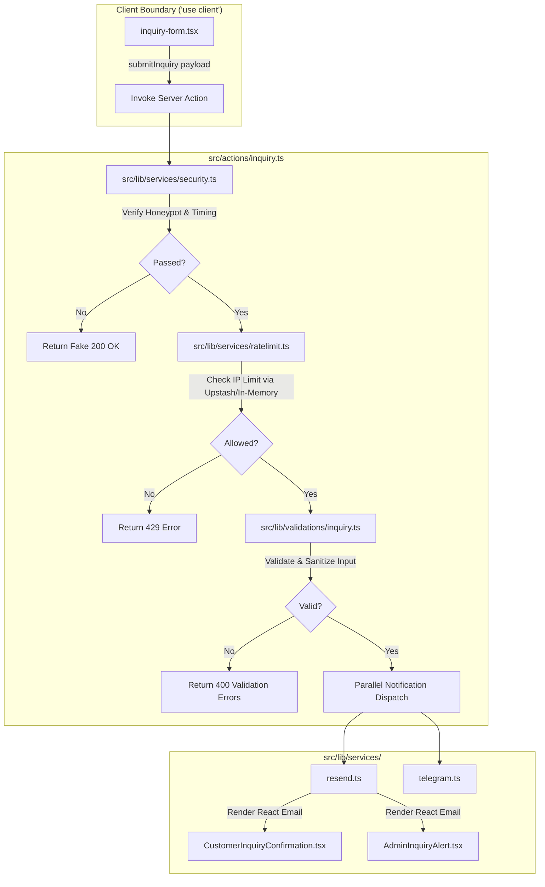
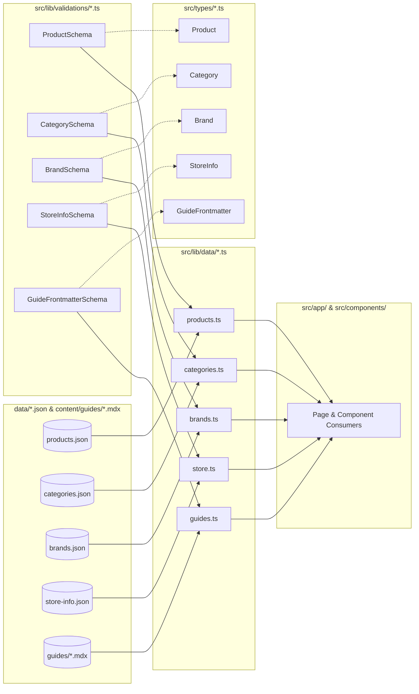
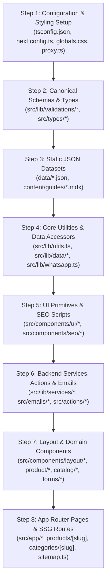

# MUSCLEWORKS SUPPLEMENTS — CANONICAL FILE MAP & DIRECTORY SPECIFICATION

**Document:** `file-map.md`  
**Purpose:** Canonical directory layout, file-level module responsibilities, component boundary definitions, and import conventions for all AI coding agents  
**Status:** Frozen & Approved for V1  
**Architecture Standard:** Next.js 16.3.0 App Router (`src/` directory convention), React 19.2.8, TypeScript Strict Mode  
**Related Docs:** `project-overview.md`, `project-tech-stacks.md`, `project-architecture.md`, `data-models.md`, `coding-standards.md`, `progress-tracker.md`  

---

## 1. DIRECTORY PHILOSOPHY & PATH ALIAS CONVENTIONS

1. **`src/` Directory Root:** All application code, components, actions, types, and library utilities reside exclusively within `src/`. Static assets live in `public/`, JSON databases in `data/`, and MDX educational content in `content/`.
2. **Path Aliases (TypeScript & Next.js):**
   - `@/*` maps directly to `./src/*`
   - `@/data/*` maps directly to `./data/*`
   - `@/content/*` maps directly to `./content/*`
   - `@/public/*` maps directly to `./public/*`
3. **Strict Server vs. Client Boundary Isolation:**
   - Server Components are the default across all layouts, pages, shells, SEO scripts, and Markdown renderers.
   - Client Components are strictly confined to interactive leaf nodes and must declare `'use client'` at the very first line of the file.
4. **Data Access via Typed Service Gateways:**
   - Components must **never** directly import raw JSON files from `@/data/`.
   - All data fetching must pass through typed accessor functions in `src/lib/data/` which parse and validate records against Zod schemas.

---

## 2. COMPLETE PROJECT TREE OVERVIEW

```text
muscleworks/
├── .agents/                               # Antigravity IDE workspace agent customizations
├── .git/                                  # Git version control repository
├── .gitignore                             # Git ignore rules
├── .next/                                 # Next.js build cache (generated)
├── AGENTS.md                              # Project instructions & Next.js 16 agent rules
├── CLAUDE.md                              # IDE agent shortcut hints
├── README.md                              # Project documentation overview
├── eslint.config.mjs                      # ESLint 9 configuration
├── next-env.d.ts                          # Next.js TypeScript declarations
├── next.config.ts                         # Next.js 16 configuration & security headers
├── package.json                           # NPM dependencies and project scripts
├── package-lock.json                      # Deterministic dependency lockfile
├── postcss.config.mjs                     # PostCSS configuration for Tailwind CSS v4
├── tsconfig.json                          # TypeScript configuration & path aliases
│
├── context/                               # CANONICAL AI AGENT SPECIFICATION CONTEXT
│   ├── project-overview.md                # Business identity, objectives, trust rules, V1 scope boundaries
│   ├── project-tech-stacks.md             # Runtime, libraries, tools, environment variables & limits
│   ├── project-architecture.md            # System architecture, rendering, pipelines, SEO & security
│   ├── data-models.md                     # Zod schemas, TypeScript types, validation rules, Nepal regex
│   ├── file-map.md                        # [THIS FILE] Complete file directory & module specifications
│   ├── coding-standards.md                # Code quality, naming, error handling, CSS & React rules
│   ├── feature-roadmap.md                 # Implementation phases, milestones, task breakdowns
│   ├── ai-workflow.md                     # Canonical AI agent operating workflow & authority rules
│   ├── progress-tracker.md                # Real-time task completion and milestone tracker
│   └── feature-specs/                     # Structured feature & implementation specification documents
│       └── README.md                      # Feature specifications guide and mandatory template
│
├── content/                               # MDX EDUCATIONAL & ARTICLE CONTENT
│   └── guides/                            # MDX Educational Guides & Articles
│       ├── whey-protein-buying-guide-nepal.mdx
│       ├── how-to-spot-fake-supplements-nepal.mdx
│       └── creatine-monohydrate-guide-for-beginners.mdx
│
├── data/                                  # CANONICAL STATIC JSON DATASETS (Git-Versioned)
│   ├── products.json                      # Catalog products, variants, pricing, nutrition & authenticity
│   ├── categories.json                    # Category taxonomy, icons, SEO descriptions & display orders
│   ├── brands.json                        # Brand profiles, logos, origin countries, verification guides
│   ├── store-info.json                    # Store address, GPS coordinates, opening hours, contact matrix
│   └── faqs.json                          # General store FAQs, authenticity, delivery & ordering rules
│
├── public/                                # PUBLIC STATIC ASSETS
│   ├── favicon.ico                        # Store favicon icon
│   ├── site.webmanifest                   # PWA web manifest
│   ├── images/                            # Optimized static imagery
│   │   ├── logo.svg                       # MUSCLEWORKS master brand logo
│   │   ├── og-default.jpg                 # Default OpenGraph social share card (1200x630)
│   │   ├── hero-banner.webp               # Homepage hero banner asset
│   │   ├── store-front.webp               # Physical store photography (Golfutar location)
│   │   ├── brands/                        # Brand partner logos
│   │   │   ├── optimum-nutrition.svg
│   │   │   ├── muscletech.svg
│   │   │   ├── dymatize.svg
│   │   │   └── myprotein.svg
│   │   ├── categories/                    # Category hero representations
│   │   │   ├── protein.webp
│   │   │   ├── creatine.webp
│   │   │   ├── pre-workout.webp
│   │   │   └── vitamins.webp
│   │   └── products/                      # Product packshot photography
│   │       ├── on-gold-standard-whey.webp
│   │       ├── muscletech-nitro-tech.webp
│   │       └── dymatize-iso-100.webp
│   └── icons/                             # Custom SVG icons and UI assets
│
└── src/                                   # APPLICATION SOURCE CODE ROOT
    ├── proxy.ts                           # Next.js 16 Request Proxy & Security Guard (Replaces middleware.ts)
    │
    ├── actions/                           # SERVER ACTIONS (Serverless Execution Boundary)
    │   └── inquiry.ts                     # submitInquiry Server Action (Honeypot, Rate Limit, Resend, Telegram)
    │
    ├── app/                               # NEXT.JS 16 APP ROUTER PAGES & LAYOUTS
    │   ├── globals.css                    # Tailwind CSS v4 design tokens, CSS variables, font definitions
    │   ├── layout.tsx                     # Root Server Layout (Fonts, Header, Footer, Analytics, LocalBusiness JSON-LD)
    │   ├── not-found.tsx                  # Custom 404 Not Found Page (Friendly discovery links)
    │   ├── error.tsx                      # Global Error Boundary Component ('use client')
    │   ├── sitemap.ts                     # Dynamic XML Sitemap Generator (Products, Categories, Brands, Guides)
    │   ├── robots.ts                      # Dynamic Robots.txt Crawler Directives
    │   │
    │   ├── (marketing)/                   # MARKETING & INFORMATIONAL ROUTE GROUP
    │   │   ├── page.tsx                   # / (Homepage: Hero, Categories, Featured Products, Trust, Location, FAQ)
    │   │   ├── about/
    │   │   │   └── page.tsx               # /about (Brand story, authenticity commitment, store history)
    │   │   ├── contact/
    │   │   │   └── page.tsx               # /contact (Contact matrix, quick WhatsApp CTA, inquiry form)
    │   │   ├── location/
    │   │   │   └── page.tsx               # /location (Golfutar store map, opening hours, directions)
    │   │   ├── faq/
    │   │   │   └── page.tsx               # /faq (Comprehensive searchable FAQ hub)
    │   │   ├── privacy-policy/
    │   │   │   └── page.tsx               # /privacy-policy (Client legal privacy notice)
    │   │   ├── terms/
    │   │   │   └── page.tsx               # /terms (Store terms & conditions)
    │   │   └── delivery-policy/
    │   │       └── page.tsx               # /delivery-policy (Kathmandu Valley & nationwide Nepal delivery policy)
    │   │
    │   ├── products/                      # PRODUCT CATALOG & DETAIL ROUTES
    │   │   ├── page.tsx                   # /products (Catalog Hub: Search, Filter, Sort, Facets)
    │   │   └── [slug]/
    │   │       └── page.tsx               # /products/[slug] (Product Detail Page: Gallery, Variant Picker, WA CTA, Nutrition)
    │   │
    │   ├── categories/                    # CATEGORY DIRECTORY & DETAIL ROUTES
    │   │   ├── page.tsx                   # /categories (Category Taxonomy Index Hub)
    │   │   └── [slug]/
    │   │       └── page.tsx               # /categories/[slug] (Category Landing Page with filtered product grid)
    │   │
    │   ├── brands/                        # BRAND DIRECTORY & DETAIL ROUTES
    │   │   ├── page.tsx                   # /brands (Brand Index Hub)
    │   │   └── [slug]/
    │   │       └── page.tsx               # /brands/[slug] (Brand Showcase Page with verification info & products)
    │   │
    │   └── guides/                        # EDUCATIONAL ARTICLES & BUYING GUIDES
    │       ├── page.tsx                   # /guides (Educational Hub & Article Index)
    │       └── [slug]/
    │           └── page.tsx               # /guides/[slug] (MDX Guide Article with related product recommendations)
    │
    ├── components/                        # REACT COMPONENT ARCHITECTURE
    │   ├── ui/                            # RADIX UI / SHADCN-STYLE PRIMITIVES (Tailwind Styled)
    │   │   ├── button.tsx                 # Button primitive with CVA variants
    │   │   ├── badge.tsx                  # Badge tag primitive (bestseller, stock, discounts)
    │   │   ├── card.tsx                   # Card container primitive
    │   │   ├── input.tsx                  # Text input field primitive
    │   │   ├── textarea.tsx               # Textarea field primitive
    │   │   ├── select.tsx                 # Accessible dropdown select primitive
    │   │   ├── dialog.tsx                 # Accessible modal dialog primitive
    │   │   ├── sheet.tsx                  # Accessible slide-over drawer primitive (mobile navigation)
    │   │   ├── accordion.tsx              # Accessible collapsible accordion primitive (FAQs)
    │   │   ├── skeleton.tsx               # Content placeholder skeleton loading primitive
    │   │   ├── separator.tsx              # Visual horizontal/vertical rule primitive
    │   │   └── sonner.tsx                 # Toast notification wrapper component
    │   │
    │   ├── layout/                        # SITE-WIDE STRUCTURAL & NAVIGATION COMPONENTS
    │   │   ├── header.tsx                 # Global Sticky Header (Server Component)
    │   │   ├── navbar.tsx                 # Desktop Navigation Links & Quick CTAs
    │   │   ├── mobile-nav.tsx             # Mobile Hamburger Drawer ('use client')
    │   │   ├── footer.tsx                 # Global Footer (Store address, quick links, trust badges, socials)
    │   │   ├── breadcrumbs.tsx            # Visual & Accessible Navigation Breadcrumbs
    │   │   ├── container.tsx              # Max-width layout container with responsive padding
    │   │   └── floating-whatsapp.tsx      # Persistent floating quick WhatsApp contact widget ('use client')
    │   │
    │   ├── product/                       # PRODUCT DISPLAY & DETAIL COMPONENTS
    │   │   ├── product-card.tsx           # Standard Product Card for grids (Price, badge, brand, quick link)
    │   │   ├── product-grid.tsx           # Responsive Product Grid layout
    │   │   ├── product-image-gallery.tsx  # Product packshot image gallery with thumbnail picker ('use client')
    │   │   ├── product-variant-picker.tsx # Reactive Size/Weight & Flavor selector with live WhatsApp URL ('use client')
    │   │   ├── product-nutrition-table.tsx# Structured Nutrition Facts & serving information table
    │   │   ├── product-authenticity-card.tsx # Visual authenticity guarantee & verification guide card
    │   │   ├── product-directions.tsx     # Direction of use, timing, and storage recommendations
    │   │   ├── product-faq-section.tsx    # Product-specific FAQ accordion
    │   │   └── related-products.tsx       # Cross-sell related product recommendations
    │   │
    │   ├── catalog/                       # CATALOG SEARCH, FILTER & FACET COMPONENTS
    │   │   ├── catalog-filter-sidebar.tsx # Desktop Category, Brand, Price & Stock facet filter sidebar
    │   │   ├── catalog-filter-drawer.tsx  # Mobile filter slide-over drawer ('use client')
    │   │   ├── catalog-search-input.tsx   # Instant search bar powered by Fuse.js & URL query sync ('use client')
    │   │   ├── catalog-sort-select.tsx    # Sorting dropdown (price-asc, price-desc, popular) ('use client')
    │   │   ├── catalog-active-filters.tsx # Removable filter pills/tags ('use client')
    │   │   ├── catalog-empty-state.tsx    # Empty search/filter results fallback with reset button
    │   │   ├── category-card.tsx          # Visual category card with icon and product counter
    │   │   └── brand-card.tsx             # Visual brand card with logo and country tag
    │   │
    │   ├── forms/                         # FORM & INPUT COMPONENTS
    │   │   ├── inquiry-form.tsx           # Lead & Inquiry submission form with React Hook Form ('use client')
    │   │   ├── form-field-wrapper.tsx     # Reusable field wrapper with label, error text, and required mark
    │   │   ├── honeypot-field.tsx         # Hidden anti-spam bot trap input component
    │   │   └── phone-input.tsx            # Nepal-formatted phone input field with country prefix
    │   │
    │   ├── guides/                        # EDUCATIONAL & MDX CONTENT COMPONENTS
    │   │   ├── guide-card.tsx             # Educational article card for guide index
    │   │   ├── guide-grid.tsx             # Responsive grid for educational guides
    │   │   ├── guide-author-bio.tsx       # Author metadata and credential badge
    │   │   ├── guide-product-rec.tsx      # Embedded product recommendation CTA card inside MDX
    │   │   └── mdx-components.tsx         # Custom MDX component mappings (Callouts, Tables, Cards)
    │   │
    │   └── seo/                           # SEO & STRUCTURED DATA (JSON-LD) COMPONENTS
    │       ├── json-ld-script.tsx         # Generic safe JSON-LD `<script>` injector
    │       ├── product-json-ld.tsx        # Schema.org `Product` + `Offer` JSON-LD generator
    │       ├── local-business-json-ld.tsx # Schema.org `LocalBusiness` / `Store` JSON-LD generator
    │       ├── breadcrumb-json-ld.tsx     # Schema.org `BreadcrumbList` JSON-LD generator
    │       ├── faq-json-ld.tsx            # Schema.org `FAQPage` JSON-LD generator
    │       └── article-json-ld.tsx        # Schema.org `Article` JSON-LD generator
    │
    ├── emails/                            # REACT EMAIL TRANSACTIONAL TEMPLATES
    │   ├── CustomerInquiryConfirmation.tsx# Branded responsive HTML confirmation email sent to customer
    │   └── AdminInquiryAlert.tsx          # Instant inquiry lead alert email sent to store managers
    │
    ├── lib/                               # CORE LOGIC, UTILITIES & DATA ACCESS
    │   ├── utils.ts                       # Classnames merger `cn()`, currency formatter `formatNprPrice()`, helpers
    │   ├── whatsapp.ts                    # Dynamic WhatsApp direct order URL builder & payload generator
    │   ├── seo.ts                         # Metadata builder helper & canonical URL generator
    │   ├── search.ts                      # Client & server Fuse.js fuzzy search index builder
    │   ├── analytics.ts                   # GA4 & Vercel custom event dispatchers (WhatsApp, Call, Form events)
    │   ├── constants.ts                   # Site-wide constants, navigation items, social links, contact info
    │   │
    │   ├── data/                          # TYPED DATA ACCESSOR GATEWAYS (Validated against Zod)
    │   │   ├── products.ts                # `getProducts()`, `getProductBySlug()`, `getFeaturedProducts()`, etc.
    │   │   ├── categories.ts              # `getCategories()`, `getCategoryBySlug()`, `getFeaturedCategories()`
    │   │   ├── brands.ts                  # `getBrands()`, `getBrandBySlug()`, `getFeaturedBrands()`
    │   │   ├── store.ts                   # `getStoreInfo()`, `getOpeningHours()`, `getDeliveryPolicy()`
    │   │   ├── faqs.ts                    # `getFAQs()`, `getFAQsByCategory()`
    │   │   └── guides.ts                  # `getAllGuides()`, `getGuideBySlug()`, `getFeaturedGuides()`
    │   │
    │   ├── services/                      # BACKEND SERVICE INTEGRATIONS (Server-Only Execution)
    │   │   ├── resend.ts                  # Resend API client & email dispatch helper
    │   │   ├── telegram.ts                # Telegram Bot API client & MarkdownV2 admin push alert dispatcher
    │   │   ├── ratelimit.ts               # Upstash Redis sliding-window rate limiter + in-memory fallback
    │   │   └── security.ts                # Honeypot verification, submission timing trap, HTML string sanitizers
    │   │
    │   └── validations/                   # CANONICAL ZOD SCHEMAS & REGEX RULES
    │       ├── common.ts                  # SEOMetadataSchema, FAQItemSchema, ImageAssetSchema
    │       ├── product.ts                 # ProductSchema, ProductVariantSchema, NutritionFactsSchema, etc.
    │       ├── taxonomy.ts                # CategorySchema, BrandSchema
    │       ├── inquiry.ts                 # InquiryFormClientSchema, InquiryServerPayloadSchema, NepalPhoneRegex
    │       ├── store.ts                   # StoreInfoSchema, OpeningHourItemSchema, GeoCoordinatesSchema
    │       └── guide.ts                   # GuideFrontmatterSchema, GuideAuthorSchema
    │
    └── types/                             # CANONICAL TYPESCRIPT TYPE DEFINITIONS (Inferred from Zod)
        ├── index.ts                       # Central re-export barrel for all types
        ├── actions.ts                     # ActionResult interface and server response envelopes
        ├── common.ts                      # SEOMetadata, FAQItem, ImageAsset
        ├── product.ts                     # Product, ProductVariant, NutritionFacts, StockStatus, ProductBadge
        ├── taxonomy.ts                    # Category, Brand
        ├── inquiry.ts                     # InquiryFormClientValues, InquiryServerPayload, InquiryType
        ├── store.ts                       # StoreInfo, DayOfWeek, OpeningHourItem, GeoCoordinates
        └── guide.ts                       # GuideFrontmatter, GuideCategory, GuideAuthor
```

---

## 3. DETAILED MODULE & FILE SPECIFICATIONS

### 3.1 Root Configuration & Infrastructure Files

| File Path | Execution Scope | Primary Responsibility | Key Exports / Role |
|---|---|---|---|
| `next.config.ts` | Node.js (Build/Server) | Configures Next.js 16 compiler options, experimental flags, image optimization domains, and HTTP security response headers. | `nextConfig: NextConfig` |
| `tsconfig.json` | Compile-time | Enforces TypeScript Strict Mode and defines path mappings (`@/*`, `@/data/*`, `@/content/*`). | Compiler Options JSON |
| `postcss.config.mjs` | Build-time | Integrates `@tailwindcss/postcss` with PostCSS for Tailwind CSS v4 compilation. | PostCSS Config Object |
| `eslint.config.mjs` | Lint-time | Enforces Next.js 16 best practices, accessibility standards, and code hygiene rules. | ESLint Flat Config Array |
| `src/proxy.ts` | Edge / Server | Next.js 16 Request Proxy & Security Gate. Injects security headers, blocks malicious paths, and validates incoming requests. | `proxy(request: NextRequest)` |

---

### 3.2 App Router (`src/app/`) Layer

| File Path | Boundary | Primary Responsibility | Dependencies / Imports |
|---|---|---|---|
| `src/app/globals.css` | Global CSS | Defines Tailwind CSS v4 theme directives, CSS color tokens (HSL variables for light/dark), and custom typography font rules. | `@import "tailwindcss";` |
| `src/app/layout.tsx` | Server Component | Root layout rendering HTML shell, preloaded Google Fonts (Outfit & Plus Jakarta Sans), Header, Footer, Sonner Toast Container, GA4 scripts, and LocalBusiness JSON-LD. | `Header`, `Footer`, `LocalBusinessJsonLd`, `Toaster` |
| `src/app/not-found.tsx` | Server Component | Custom 404 page with high-conversion recovery links (popular categories, search CTA, home link). | `Button`, `Link`, `Search` |
| `src/app/error.tsx` | Client Component | React error boundary capturing uncaught runtime exceptions with friendly reset recovery. | `'use client'`, `Button` |
| `src/app/sitemap.ts` | Serverless Function | Dynamically generates `/sitemap.xml` by querying `getProducts()`, `getCategories()`, `getBrands()`, and `getAllGuides()`. | `MetadataRoute.Sitemap`, `src/lib/data/*` |
| `src/app/robots.ts` | Serverless Function | Dynamically generates `/robots.txt` with allow/disallow rules and dynamic sitemap reference. | `MetadataRoute.Robots` |

#### Marketing Route Group (`src/app/(marketing)/`)

| File Path | Boundary | Primary Responsibility | Data Accessor Used |
|---|---|---|---|
| `src/app/(marketing)/page.tsx` | Server Component | Homepage: Hero Banner, Category Quick Grid, Featured Products Showcase, Authenticity Value Props, Store Location Preview, FAQ Teaser. | `getFeaturedProducts()`, `getFeaturedCategories()`, `getStoreInfo()` |
| `src/app/(marketing)/about/page.tsx` | Server Component | About Us: MUSCLEWORKS founding story (2026), product philosophy, authenticity pledge, quality standards. | `getStoreInfo()` |
| `src/app/(marketing)/contact/page.tsx` | Server Component | Contact Us: Store contact matrix, direct WhatsApp CTAs, interactive `InquiryForm`, Google Maps embed. | `getStoreInfo()`, `InquiryForm` |
| `src/app/(marketing)/location/page.tsx` | Server Component | Store Location: Golfutar, Budha-Nilkantha address, opening hours, landmarks, interactive map, driving directions. | `getStoreInfo()` |
| `src/app/(marketing)/faq/page.tsx` | Server Component | Comprehensive FAQ: Searchable FAQ categories (authenticity, ordering, delivery, product usage) + `FAQPage` JSON-LD. | `getFAQs()`, `FAQJsonLd` |
| `src/app/(marketing)/privacy-policy/page.tsx` | Server Component | Privacy Policy: Data collection, inquiry storage, customer contact usage rules. | Static Legal Content |
| `src/app/(marketing)/terms/page.tsx` | Server Component | Terms & Conditions: Product disclaimer, pricing, nationwide delivery terms. | Static Legal Content |
| `src/app/(marketing)/delivery-policy/page.tsx` | Server Component | Delivery Policy: Kathmandu Valley same-day/next-day terms, nationwide Nepal courier timeline, fees. | `getDeliveryPolicy()` |

#### Dynamic Catalog & Content Routes

| File Path | Boundary | Primary Responsibility | Data Accessor Used |
|---|---|---|---|
| `src/app/products/page.tsx` | Server Component Shell | Catalog Hub: Renders catalog grid shell, filter sidebar, and connects to URL query parameters (`?category=`, `?brand=`, `?q=`, `?sort=`). | `getProducts()`, `getCategories()`, `getBrands()` |
| `src/app/products/[slug]/page.tsx` | Server Component (SSG) | Product Detail Page: `generateStaticParams()`, `generateMetadata()`, image gallery, interactive variant picker, WhatsApp CTA, nutrition table, authenticity card, related products, `ProductJsonLd`. | `getProductBySlug()`, `getRelatedProducts()`, `getProducts()` |
| `src/app/categories/page.tsx` | Server Component | Category Hub: Grid of all available supplement categories with product counts and quick navigation. | `getCategories()`, `getProducts()` |
| `src/app/categories/[slug]/page.tsx` | Server Component (SSG) | Category Landing Page: `generateStaticParams()`, `generateMetadata()`, category intro, SEO content, filtered product grid, category FAQ. | `getCategoryBySlug()`, `getProductsByCategory()` |
| `src/app/brands/page.tsx` | Server Component | Brand Directory Hub: Listing of all official international and local brands with logos and origin flags. | `getBrands()` |
| `src/app/brands/[slug]/page.tsx` | Server Component (SSG) | Brand Landing Page: `generateStaticParams()`, `generateMetadata()`, brand story, authenticity verification guide, brand product grid. | `getBrandBySlug()`, `getProductsByBrand()` |
| `src/app/guides/page.tsx` | Server Component | Educational Hub: Grid of all buying guides and sports nutrition articles. | `getAllGuides()` |
| `src/app/guides/[slug]/page.tsx` | Server Component (SSG) | Guide Article Page: `generateStaticParams()`, `generateMetadata()`, MDX content rendering, author credentials, related product CTAs, `ArticleJsonLd`. | `getGuideBySlug()`, `getAllGuides()` |

---

### 3.3 UI Component Library (`src/components/`)

#### 3.3.1 Primitives (`src/components/ui/`)
All UI primitives are built using Radix UI headless primitives styled with Tailwind CSS v4 and `class-variance-authority`:
- `button.tsx`: Multi-variant button (`default`, `destructive`, `outline`, `secondary`, `ghost`, `link`, `whatsapp`, `accent`).
- `badge.tsx`: Tag badges (`default`, `secondary`, `destructive`, `outline`, `success`, `bestseller`, `deal`).
- `card.tsx`: `Card`, `CardHeader`, `CardTitle`, `CardDescription`, `CardContent`, `CardFooter`.
- `input.tsx`: Accessible HTML text input with focus rings and error states.
- `textarea.tsx`: Auto-expanding accessible textarea.
- `select.tsx`: Radix UI Select wrapper with styled trigger, viewport, and items.
- `dialog.tsx`: Radix UI Dialog modal wrapper.
- `sheet.tsx`: Radix UI Dialog styled as sliding drawer (left, right, bottom).
- `accordion.tsx`: Radix UI Accordion wrapper for FAQ and collapsible sections.
- `skeleton.tsx`: Animated shimmer placeholder for loading states.
- `separator.tsx`: Horizontal/vertical decorative divider.
- `sonner.tsx`: Sonner toast provider styled to match the dark/light athletic theme.

#### 3.3.2 Layout Components (`src/components/layout/`)
- `header.tsx` (Server Component): Master header with logo, desktop navigation menu, search trigger, WhatsApp direct contact button, and mobile menu trigger.
- `navbar.tsx` (Server Component): Desktop navigation bar highlighting catalog categories, brands, guides, store location, and contact.
- `mobile-nav.tsx` (`'use client'`): Mobile slide-over navigation drawer with category accordions and quick call/WhatsApp buttons.
- `footer.tsx` (Server Component): Multi-column footer containing store address, contact matrix, opening hours, legal links, authenticity badge, and social links.
- `breadcrumbs.tsx` (Server Component): Visual breadcrumb navigation path with accessible ARIA tags and `BreadcrumbJsonLd` synchronization.
- `container.tsx` (Server Component): Responsive container wrapper (`max-w-7xl mx-auto px-4 sm:px-6 lg:px-8`).
- `floating-whatsapp.tsx` (`'use client'`): Sticky bottom-right floating WhatsApp widget with pulse animation, opening pre-filled store inquiry link.

#### 3.3.3 Product Components (`src/components/product/`)
- `product-card.tsx` (Server Component): Standard product card displaying image, brand name, product title, starting price in NPR, stock badge, and "View Details" link.
- `product-grid.tsx` (Server Component): CSS Grid layout (`grid-cols-1 sm:grid-cols-2 md:grid-cols-3 lg:grid-cols-4 gap-6`).
- `product-image-gallery.tsx` (`'use client'`): Interactive packshot image viewer with main display, thumbnail selector, and image zoom.
- `product-variant-picker.tsx` (`'use client'`): Reactive component allowing users to choose Size/Weight (e.g. 2 lbs, 5 lbs) and Flavor (e.g. Chocolate, Vanilla), updating displayed price, SKU, stock status, and generating the dynamic WhatsApp order link with GA4 tracking.
- `product-nutrition-table.tsx` (Server Component): Detailed tabular breakdown of calories, protein, BCAAs, and nutrition facts per serving.
- `product-authenticity-card.tsx` (Server Component): Visual trust badge highlighting genuine importer sourcing, security hologram instructions, and scratch-off verification steps.
- `product-directions.tsx` (Server Component): How-to-use guide, recommended timing (pre/post workout), and storage instructions.
- `product-faq-section.tsx` (Server Component): Collapsible FAQ accordion customized for the specific product.
- `related-products.tsx` (Server Component): Curated list of complementary or alternative products.

#### 3.3.4 Catalog Components (`src/components/catalog/`)
- `catalog-filter-sidebar.tsx` (Server Component Shell): Desktop sidebar organizing filters by Category, Brand, Price Range, and In-Stock toggle.
- `catalog-filter-drawer.tsx` (`'use client'`): Mobile slide-over sheet containing all catalog filter facets.
- `catalog-search-input.tsx` (`'use client'`): Search input utilizing Fuse.js for instant client-side fuzzy searching while keeping URL query strings in sync via `nuqs`.
- `catalog-sort-select.tsx` (`'use client'`): Dropdown selector for sorting (`price-asc`, `price-desc`, `popular`, `name`).
- `catalog-active-filters.tsx` (`'use client'`): Dismissible badge pills showing active filter criteria with "Clear All" action.
- `catalog-empty-state.tsx` (Server Component): Friendly fallback illustration shown when no products match filter criteria, with a quick "Reset Filters" CTA.
- `category-card.tsx` (Server Component): Card showcasing category thumbnail, title, description snippet, and product count.
- `brand-card.tsx` (Server Component): Card displaying brand logo, country of origin badge, and brand description snippet.

#### 3.3.5 Forms (`src/components/forms/`)
- `inquiry-form.tsx` (`'use client'`): Interactive form built with `react-hook-form` + `@hookform/resolvers/zod` connecting to the `submitInquiry` Server Action. Features pending loading state and Sonner toast triggers.
- `form-field-wrapper.tsx` (Client/Server): Accessible wrapper rendering field label, optional tooltip, and Zod error message.
- `honeypot-field.tsx` (`'use client'`): Hidden field (`hp_field`) and hidden timestamp (`_form_loaded_at`) for bot detection.
- `phone-input.tsx` (`'use client'`): Specialized phone number input formatted for Nepal phone numbers (`+977` prefix).

#### 3.3.6 Guides & MDX (`src/components/guides/`)
- `guide-card.tsx` (Server Component): Educational guide preview card displaying cover image, category badge, title, excerpt, author, and reading time.
- `guide-grid.tsx` (Server Component): Responsive grid for educational articles.
- `guide-author-bio.tsx` (Server Component): Author profile card highlighting credentials and sports nutrition background.
- `guide-product-rec.tsx` (Server Component): In-article high-conversion product card with direct WhatsApp order CTA embedded inside MDX guides.
- `mdx-components.tsx` (Server Component): Custom component mapping passed to MDX renderers (styled headings, tables, callout alert boxes, product cards).

#### 3.3.7 SEO & JSON-LD Scripts (`src/components/seo/`)
- `json-ld-script.tsx` (Server Component): Safe script wrapper injecting `application/ld+json` payloads into HTML.
- `product-json-ld.tsx` (Server Component): Generates Schema.org `Product` and `Offer` structured data.
- `local-business-json-ld.tsx` (Server Component): Generates Schema.org `LocalBusiness` / `Store` structured data.
- `breadcrumb-json-ld.tsx` (Server Component): Generates Schema.org `BreadcrumbList` structured data.
- `faq-json-ld.tsx` (Server Component): Generates Schema.org `FAQPage` structured data.
- `article-json-ld.tsx` (Server Component): Generates Schema.org `Article` structured data for MDX guides.

---

### 3.4 Server Actions & Backend Services Layer (`src/actions/` & `src/lib/services/`)



| File Path | Execution Scope | Primary Responsibility | Key Functions / Exports |
|---|---|---|---|
| `src/actions/inquiry.ts` | Serverless Function | Main Server Action processing customer inquiries, verifying honeypots, executing rate limiting, validating data, and triggering parallel email/Telegram dispatches. | `submitInquiry(formData: InquiryFormClientValues): Promise<ActionResponse>` |
| `src/lib/services/security.ts` | Server-Only | Verifies honeypot trap, checks form submission duration (>2000ms), and strips HTML/script tags from user inputs to prevent XSS. | `verifyHoneypot()`, `verifySubmissionTiming()`, `sanitizeInput()` |
| `src/lib/services/ratelimit.ts` | Server-Only | Enforces IP-based sliding-window rate limit (max 5 requests/hr) using `@upstash/ratelimit` with an automatic in-memory fallback cache for local dev. | `checkRateLimit(ip: string): Promise<{ success: boolean }>` |
| `src/lib/services/resend.ts` | Server-Only | Initializes Resend client and sends branded React Email templates to customer and admin. | `sendCustomerConfirmationEmail()`, `sendAdminNotificationEmail()` |
| `src/lib/services/telegram.ts` | Server-Only | Sends instant MarkdownV2 formatted push alerts to store admin Telegram chat via Telegram Bot API `fetch`. | `sendTelegramAdminAlert(payload: InquiryServerPayload): Promise<boolean>` |

---

### 3.5 React Email Templates (`src/emails/`)

| File Path | Render Target | Primary Responsibility | Props Interface |
|---|---|---|---|
| `src/emails/CustomerInquiryConfirmation.tsx` | Responsive HTML Email | Branded email sent to the customer confirming their inquiry was received and explaining next steps (store contact, WhatsApp follow-up). | `CustomerInquiryConfirmationProps` |
| `src/emails/AdminInquiryAlert.tsx` | Responsive HTML Email | High-priority email sent to store managers containing customer name, phone number, email, inquiry type, message, and product context. | `AdminInquiryAlertProps` |

---

### 3.6 Data Layer & Accessors (`data/`, `src/lib/data/`, `src/lib/validations/`, `src/types/`)



#### Data Accessor Specifications (`src/lib/data/`)

| File Path | Source Data | Key Functions & Responsibilities | Return Types |
|---|---|---|---|
| `src/lib/data/products.ts` | `data/products.json` | - `getProducts()`: Returns all active validated products.<br>- `getProductBySlug(slug)`: Returns single product by slug.<br>- `getFeaturedProducts()`: Returns products where `isFeatured: true`.<br>- `getProductsByCategory(catId)`: Filters products by category.<br>- `getProductsByBrand(brandId)`: Filters products by brand.<br>- `getRelatedProducts(productId, catId, limit)`: Returns related products. | `Product[]`, `Product \| null` |
| `src/lib/data/categories.ts` | `data/categories.json` | - `getCategories()`: Returns all categories sorted by `displayOrder`.<br>- `getCategoryBySlug(slug)`: Returns category by slug.<br>- `getFeaturedCategories()`: Returns featured categories. | `Category[]`, `Category \| null` |
| `src/lib/data/brands.ts` | `data/brands.json` | - `getBrands()`: Returns all active brand profiles.<br>- `getBrandBySlug(slug)`: Returns single brand profile.<br>- `getFeaturedBrands()`: Returns featured brand partners. | `Brand[]`, `Brand \| null` |
| `src/lib/data/store.ts` | `data/store-info.json` | - `getStoreInfo()`: Returns full store profile, address, GPS coords.<br>- `getOpeningHours()`: Returns store opening hours matrix.<br>- `getDeliveryPolicy()`: Returns nationwide delivery zone rules. | `StoreInfo`, `OpeningHourItem[]`, `DeliveryZonePolicy` |
| `src/lib/data/guides.ts` | `content/guides/*.mdx` | - `getAllGuides()`: Parses MDX frontmatter and returns all articles sorted by `publishedDate`.<br>- `getGuideBySlug(slug)`: Returns MDX source and parsed frontmatter.<br>- `getFeaturedGuides()`: Returns featured guides. | `GuideFrontmatter[]`, `{ frontmatter, content } \| null` |

---

### 3.7 Core Utilities & Helpers (`src/lib/`)

| File Path | Responsibility | Key Exported Functions |
|---|---|---|
| `src/lib/utils.ts` | General utility helper functions. | `cn(...inputs)` (Tailwind class merger via `clsx` + `tailwind-merge`), `formatNprPrice(price)` (Formats integers to `NPR 12,500`), `formatDate(dateStr)` |
| `src/lib/whatsapp.ts` | WhatsApp direct URL generator. | `generateWhatsAppOrderUrl({ product, variant, storePhone })`, `generateWhatsAppGeneralInquiryUrl({ storePhone })` |
| `src/lib/seo.ts` | SEO metadata and canonical builders. | `constructMetadata({ title, description, image, canonicalUrl, noIndex })`, `getBaseUrl()` |
| `src/lib/search.ts` | Fuzzy search engine using Fuse.js. | `createProductSearchIndex(products)`, `searchProducts(index, query)` |
| `src/lib/analytics.ts` | Google Analytics 4 & Vercel event dispatchers. | `trackWhatsAppOrderClick(productData)`, `trackPhoneCallClick()`, `trackInquirySubmit(inquiryType)`, `trackFilterApply(filterType, value)` |
| `src/lib/constants.ts` | Centralized site-wide constants. | `SITE_CONFIG` (site name, URL, default OG image), `NAV_ITEMS`, `FOOTER_NAV`, `CONTACT_INFO`, `SOCIAL_LINKS` |

---

## 4. SERVER VS. CLIENT COMPONENT BOUNDARY MATRIX

To maintain minimal JavaScript bundle sizes and ultra-fast Core Web Vitals, every component is categorized into either a Server Component (RSC) or a Client Component (`'use client'`):

| Component Path | Component Name | Boundary | Reason for Client Boundary / Interactivity |
|---|---|---|---|
| `src/app/layout.tsx` | RootLayout | **Server** | Pure HTML shell, preloaded fonts, static layout. |
| `src/app/(marketing)/*/page.tsx` | All Marketing Pages | **Server** | Static marketing content pre-rendered at build time. |
| `src/app/products/page.tsx` | ProductsPage | **Server** | Static shell with server data passing to client controls. |
| `src/app/products/[slug]/page.tsx` | ProductDetailPage | **Server** | Static Site Generation (SSG) with `generateStaticParams`. |
| `src/components/layout/header.tsx` | Header | **Server** | Static navigation structure and brand logo. |
| `src/components/layout/mobile-nav.tsx` | MobileNav | **Client (`'use client'`)** | Requires open/close state for slide-over navigation drawer. |
| `src/components/layout/floating-whatsapp.tsx` | FloatingWhatsApp | **Client (`'use client'`)** | Scroll listener and GA4 click event tracking. |
| `src/components/product/product-variant-picker.tsx` | ProductVariantPicker | **Client (`'use client'`)** | Interactive size/flavor buttons updating price and WhatsApp link. |
| `src/components/product/product-image-gallery.tsx` | ProductImageGallery | **Client (`'use client'`)** | Interactive thumbnail clicking and full-size image switching. |
| `src/components/catalog/catalog-search-input.tsx` | CatalogSearchInput | **Client (`'use client'`)** | Real-time keystroke input, Fuse.js fuzzy index, URL query sync (`nuqs`). |
| `src/components/catalog/catalog-sort-select.tsx` | CatalogSortSelect | **Client (`'use client'`)** | Dropdown selection syncing sort parameter to URL. |
| `src/components/catalog/catalog-active-filters.tsx` | CatalogActiveFilters | **Client (`'use client'`)** | Interactive pill removal and filter state resets. |
| `src/components/catalog/catalog-filter-drawer.tsx` | CatalogFilterDrawer | **Client (`'use client'`)** | Mobile filter sheet open/close state. |
| `src/components/forms/inquiry-form.tsx` | InquiryForm | **Client (`'use client'`)** | Form input state, client Zod validation, Server Action execution, toast feedback. |
| `src/components/forms/phone-input.tsx` | PhoneInput | **Client (`'use client'`)** | Input masking and phone formatting events. |
| `src/components/ui/sonner.tsx` | Toaster | **Client (`'use client'`)** | Sonner client-side toast event listener. |
| `src/components/seo/*` | All JSON-LD Injectors | **Server** | Direct `<script>` tag injection into server-rendered HTML. |

---

## 5. FILE CREATION SEQUENCE & IMPLEMENTATION BLUEPRINT

When transitioning from the Context Specification phase to feature implementation, AI coding agents must construct files in the following strict dependency order:



1. **Step 1: Configuration & Styling Setup**
   - Update `tsconfig.json` with `@/*` and `@/data/*` path aliases.
   - Configure `next.config.ts` with security headers and image domains.
   - Set up `src/app/globals.css` with Tailwind CSS v4 variables.
   - Create `src/proxy.ts` request proxy.
2. **Step 2: Canonical Schemas & Types**
   - Create Zod schemas in `src/lib/validations/` (`common.ts`, `product.ts`, `taxonomy.ts`, `inquiry.ts`, `store.ts`, `guide.ts`).
   - Create inferred types in `src/types/` (`common.ts`, `product.ts`, `taxonomy.ts`, `inquiry.ts`, `store.ts`, `guide.ts`, `index.ts`).
3. **Step 3: Static JSON Datasets**
   - Author initial seed datasets in `data/` (`products.json`, `categories.json`, `brands.json`, `store-info.json`, `faqs.json`).
   - Author seed MDX buying guides in `content/guides/`.
4. **Step 4: Core Utilities & Data Accessors**
   - Create `src/lib/utils.ts`, `src/lib/constants.ts`, `src/lib/seo.ts`, `src/lib/whatsapp.ts`, `src/lib/search.ts`, `src/lib/analytics.ts`.
   - Build typed data accessors in `src/lib/data/` (`products.ts`, `categories.ts`, `brands.ts`, `store.ts`, `guides.ts`).
5. **Step 5: UI Primitives & SEO Injectors**
   - Implement Radix UI / Shadcn primitives in `src/components/ui/`.
   - Implement JSON-LD injectors in `src/components/seo/`.
6. **Step 6: Backend Services, Actions & Emails**
   - Build `src/lib/services/` (`security.ts`, `ratelimit.ts`, `resend.ts`, `telegram.ts`).
   - Create React Email templates in `src/emails/`.
   - Implement `src/actions/inquiry.ts`.
7. **Step 7: Layout & Domain Components**
   - Build `src/components/layout/` (`header.tsx`, `footer.tsx`, `mobile-nav.tsx`, `floating-whatsapp.tsx`, `breadcrumbs.tsx`).
   - Build `src/components/product/`, `src/components/catalog/`, `src/components/forms/`, `src/components/guides/`.
8. **Step 8: App Router Pages & SSG Routes**
   - Build `src/app/layout.tsx`, `not-found.tsx`, `error.tsx`, `sitemap.ts`, `robots.ts`.
   - Build marketing pages (`src/app/(marketing)/*`).
   - Build catalog and dynamic pages (`src/app/products/*`, `categories/*`, `brands/*`, `guides/*`).

---

## 6. COMPLIANCE & VERIFICATION CHECKLIST FOR CODING AGENTS

- [x] All application code uses the `src/` directory root.
- [x] Path aliases are standardized to `@/*` (for `src/`) and `@/data/*` (for `data/`).
- [x] Every file path has an assigned execution boundary (Server Component, Client Component, Server Action, Edge/Node).
- [x] Server Components are used by default; Client Components (`'use client'`) are strictly limited to interactive leaf nodes.
- [ ] Data layer enforces access via typed functions in `src/lib/data/` rather than raw JSON imports.
- [x] Server Actions isolate private credentials (`RESEND_API_KEY`, `TELEGRAM_BOT_TOKEN`, `UPSTASH_*`) completely from client bundles.
- [x] Next.js 16 breaking conventions (`proxy.ts` instead of `middleware.ts`, native `generateMetadata`, App Router) are strictly respected.
