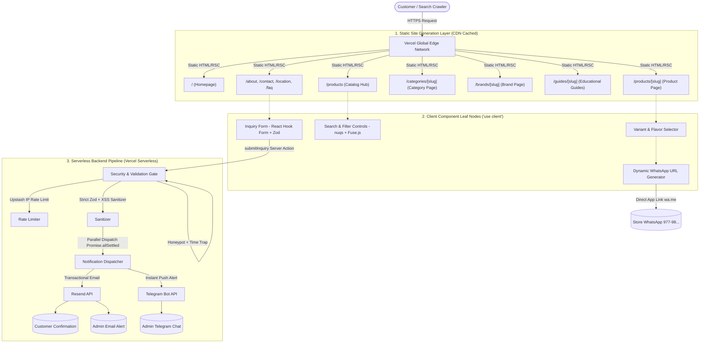
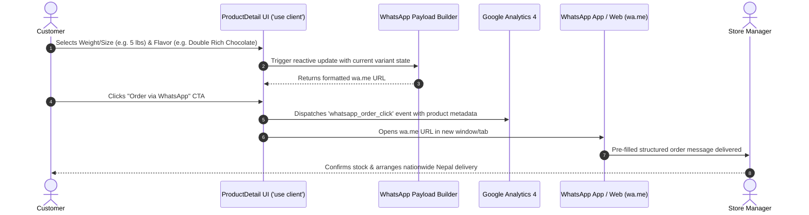
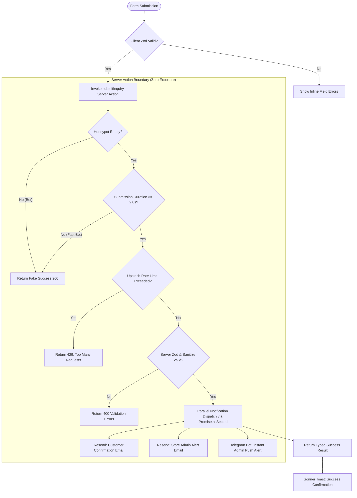

# MUSCLEWORKS SUPPLEMENTS — SYSTEM ARCHITECTURE SPECIFICATION

**Document:** `project-architecture.md`  
**Purpose:** Canonical system architecture and technical design specification for all AI coding agents  
**Status:** Frozen & Approved for V1  
**Hosting Target:** Vercel (Edge Network + Serverless Functions)  
**Related Docs:** `project-overview.md`, `project-tech-stacks.md`, `data-models.md`, `file-map.md`, `coding-standards.md`, `progress-tracker.md`  

---

## 1. ARCHITECTURAL OVERVIEW & PRINCIPLES

MUSCLEWORKS SUPPLEMENTS is architected as a **high-performance, mobile-first product discovery and order-generation web application** built with Next.js 16 (App Router), React 19, and TypeScript.

### Core Architectural Principles
1. **Ultra-Fast CDN Delivery (0ms TTFB):** All public catalog, brand, category, educational, and marketing pages are pre-rendered at build time via Static Site Generation (SSG).
2. **Server-First with Minimal Client Footprint:** React Server Components (RSC) are used by default. Client components (`'use client'`) are strictly isolated to interactive leaf nodes (e.g., search/filter controls, variant selectors, inquiry forms, toast alerts).
3. **Frictionless Conversion Funnel:** Optimized for the primary mobile journey: `Google / Social Discovery → Product Page → Variant Selection → WhatsApp Direct Order / Phone Call / Inquiry Form`.
4. **Resilient Serverless Action Pipelines:** Private integrations (Resend transactional email, Telegram Bot admin alerts, Upstash rate limiting) run exclusively within Next.js Server Actions with zero credential exposure.
5. **Next.js 16 Standards Compliance:** Uses `proxy.ts` (Next.js 16 file convention replacing deprecated `middleware.ts`), native `generateMetadata`, and modern App Router patterns.



---

## 2. RENDERING & CACHING STRATEGY

### 2.1 Static Site Generation (SSG) with `generateStaticParams`
Every product, category, brand, and educational guide route is statically pre-rendered at compile time using local datasets in `data/` and MDX files in `content/guides/`.

| Route Pattern | Rendering Mode | Generation Method | Caching Behavior |
|---|---|---|---|
| `/` | Full SSG | Build-time pre-render | Immutable on CDN; re-deployed on Git push |
| `/products` | Full SSG (Shell) + Client State | Build-time pre-render | Base catalog shell cached; client filters sync via URL query |
| `/products/[slug]` | Full SSG | `generateStaticParams()` over all active products | Static HTML + JSON payload; 0ms CDN delivery |
| `/categories` & `/categories/[slug]` | Full SSG | `generateStaticParams()` over all active categories | Static HTML + Category SEO content + product cards |
| `/brands` & `/brands/[slug]` | Full SSG | `generateStaticParams()` over all active brands | Static HTML + Brand story + brand product cards |
| `/guides` & `/guides/[slug]` | Full SSG | `generateStaticParams()` over all MDX files | Static HTML + Article schema + internal product links |
| `/about`, `/contact`, `/location`, `/faq` | Full SSG | Build-time pre-render | Static HTML + LocalBusiness & FAQ schemas |
| `/sitemap.xml` | Dynamic SSG | Next.js `app/sitemap.ts` | Dynamically generated from active datasets |
| `/robots.txt` | Dynamic SSG | Next.js `app/robots.ts` | Dynamically generated robots directives |

### 2.2 Server Components vs. Client Components Boundary
To guarantee minimal JavaScript bundle sizes and optimal mobile performance:
- **Server Components (Default):** Layouts, Page shells, SEO metadata generators, JSON-LD Schema injectors, Markdown renderers, Static Product Cards, Static Footers, and Breadcrumbs.
- **Client Components (`'use client'`):**
  - `ProductVariantSelector`: Reactive size/flavor picker updating prices, stock alerts, and WhatsApp CTA links.
  - `CatalogSearchFilter`: Interactive search input (Fuse.js) and facet filters synced to URL via `nuqs`.
  - `InquiryForm`: Interactive form with React Hook Form, Honeypot field, and submit state.
  - `MobileNavDrawer`: Hamburger navigation drawer and sheet dialogs.
  - `FloatingWhatsAppButton`: Persistent bottom-right floating quick contact CTA.
  - `ToastProvider`: Sonner toast container for notification feedback.

---

## 3. ROUTING & URL HIERARCHY

The application enforces a clean, flat, search-engine-friendly URL structure:

```
app/
├── (marketing)/
│   ├── page.tsx                           # / (Homepage)
│   ├── about/page.tsx                     # /about
│   ├── contact/page.tsx                   # /contact
│   ├── location/page.tsx                  # /location (Store map & local directions)
│   ├── faq/page.tsx                       # /faq (Comprehensive store FAQ)
│   ├── privacy-policy/page.tsx            # /privacy-policy
│   ├── terms/page.tsx                     # /terms
│   └── delivery-policy/page.tsx           # /delivery-policy
├── products/
│   ├── page.tsx                           # /products (Catalog Hub: ?category=..&brand=..&q=..&sort=..)
│   └── [slug]/
│       └── page.tsx                       # /products/[slug] (Product Detail Page)
├── categories/
│   ├── page.tsx                           # /categories (Category Index Hub)
│   └── [slug]/
│       └── page.tsx                       # /categories/[slug] (Category Landing Page)
├── brands/
│   ├── page.tsx                           # /brands (Brand Index Hub)
│   └── [slug]/
│       └── page.tsx                       # /brands/[slug] (Brand Landing Page)
├── guides/
│   ├── page.tsx                           # /guides (Educational Hub)
│   └── [slug]/
│       └── page.tsx                       # /guides/[slug] (Educational Buying Guide)
├── sitemap.ts                             # /sitemap.xml
├── robots.ts                              # /robots.txt
└── layout.tsx                             # Root Layout (Fonts, Header, Footer, Analytics, JSON-LD)
```

### 3.1 Catalog Filter URL Schema (`/products`)
Filter and search parameters are bidirectionally bound to URL query parameters via `nuqs`:
- `?q=whey`: Search keyword.
- `?category=protein`: Category filter slug.
- `?brand=optimum-nutrition`: Brand filter slug.
- `?sort=price-asc | price-desc | popular`: Sorting order.
- `?inStock=true`: Stock filter toggle.

*Benefit:* Every catalog view is directly shareable, linkable, and maintains full browser history navigation without full page reloads.

---

## 4. WHATSAPP DIRECT ORDERING ARCHITECTURE

WhatsApp is MUSCLEWORKS’ primary conversion channel. The architecture guarantees high conversion with zero checkout friction.



### 4.1 Message Payload Structure
The dynamic generator produces clean, formatted messages with clear visual hierarchy:

```text
Namaste MUSCLEWORKS! 🇳🇵

I would like to order / inquire about:
📦 Product: {product_name}
🏷️ Brand: {brand_name}
⚖️ Size / Weight: {selected_weight}
🍫 Flavor: {selected_flavor}
💰 Price: NPR {variant_price}
🆔 SKU: {sku}
🔗 Link: https://muscleworksnepal.com/products/{slug}

Please confirm availability and delivery to my location.
```

### 4.2 Global Floating Quick Action
For non-product pages (Home, About, Location, Guides), a floating WhatsApp button triggers a general store inquiry:
```text
Namaste MUSCLEWORKS! 🇳🇵
I have a general question regarding your supplement catalog and store in Golfutar, Kathmandu.
```

---

## 5. INQUIRY & SERVER ACTIONS PIPELINE

For formal inquiries, corporate bulk orders, or customers preferring email/contact forms, the `submitInquiry` Server Action provides an automated, anti-spam, multi-channel notification pipeline.



### 5.1 Pipeline Stages
1. **Client Layer:** Form state managed by `react-hook-form` + `@hookform/resolvers/zod`.
2. **Anti-Bot Layer (Honeypot + Time Trap):**
   - Hidden field `hp_field` (hidden via CSS and `aria-hidden="true"`). If filled, execution silently aborts.
   - `_form_loaded_at` hidden timestamp. If submitted in under 2000ms, execution silently aborts.
3. **Rate Limiting Layer:** `@upstash/ratelimit` sliding window (max 5 submissions per IP per 60 minutes). If Upstash is not configured in local development, it gracefully falls back to an in-memory sliding window cache.
4. **Server Validation & Sanitization Layer:** Strict Server Zod parsing; all strings sanitized using HTML tag stripping to prevent XSS and formatting injections.
5. **Parallel Notification Dispatch Layer:** `Promise.allSettled` runs:
   - **Customer Email:** Responsive HTML confirmation template via `resend` + `@react-email/components`.
   - **Admin Alert Email:** Instant notification with customer phone, email, and inquiry details to store manager.
   - **Telegram Push Alert:** Direct HTTP POST to Telegram Bot API with MarkdownV2 formatted message.
6. **Client Feedback:** Returns `{ success: true, message: string }` or structured error map to display a toast via Sonner.

---

## 6. SEO & STRUCTURED DATA ARCHITECTURE

Technical SEO is a core requirement for MUSCLEWORKS to dominate organic search results across Kathmandu and nationwide Nepal.

### 6.1 Metadata Generation Pipeline (`generateMetadata`)
- **Dynamic Product Pages:**
  - Title: `{Product Name} Price in Nepal | MUSCLEWORKS`
  - Description: `Buy authentic {Product Name} by {Brand} at MUSCLEWORKS Nepal. Available in {Weights/Flavors}. Fast delivery across Kathmandu & nationwide.`
  - Canonical URL: `https://muscleworksnepal.com/products/{slug}`
  - OpenGraph: High-resolution product image, price, currency (NPR), brand, and stock status.
- **Dynamic Category Pages:**
  - Title: `Buy {Category Name} Supplements in Nepal | MUSCLEWORKS`
  - Description: `Explore 100% authentic {Category Name} from top international and local brands. Best prices and nationwide Nepal delivery.`
- **Dynamic Brand Pages:**
  - Title: `Authentic {Brand Name} Supplements in Nepal | MUSCLEWORKS`
  - Description: `Official retail products by {Brand Name} in Nepal. Guaranteed genuine {Brand Name} supplements in Golfutar, Kathmandu.`
- **Educational Guides:**
  - Title: `{Guide Title} | MUSCLEWORKS Nepal`
  - OpenGraph: Article metadata, author, publication date.

### 6.2 Schema.org Structured Data (JSON-LD)
Using `schema-dts`, type-safe JSON-LD schemas are embedded directly into Server Components:

| Schema Type | Applied Pages | Included Data |
|---|---|---|
| `LocalBusiness` / `Store` | Root Layout & `/location`, `/contact` | Store Name, Golfutar Address, Geo-coordinates, Opening Hours (Sun-Fri 10AM-9PM), Phone, WhatsApp, SameAs Social links. |
| `Product` + `Offer` | `/products/[slug]` | Product Name, Brand, Images, Description, SKU, ItemCondition (`NewCondition`), Offers (`price`, `priceCurrency: NPR`, `availability: InStock | OutOfStock`, `seller`). |
| `FAQPage` | `/faq`, `/products/[slug]`, `/categories/[slug]` | Question & Answer pairs for Google Rich Snippets in SERPs. |
| `BreadcrumbList` | All sub-pages | Hierarchical navigation paths (`Home > Products > Category > Product`). |
| `Article` | `/guides/[slug]` | Article headline, datePublished, dateModified, author, publisher. |

### 6.3 Dynamic Sitemap & Robots
- **`app/sitemap.ts`:** Programmatically iterates over all static routes, products, categories, brands, and guides to output `sitemap.xml` with appropriate `changeFrequency` and `priority` values.
- **`app/robots.ts`:** Permits all legitimate search bots to crawl the entire site, references `/sitemap.xml`, and disallows internal API/proxy paths.

---

## 7. SECURITY ARCHITECTURE & BOUNDARY LAYERS

### 7.1 Next.js 16 Proxy & HTTP Security Headers
In accordance with Next.js 16 breaking conventions, request-level proxying and security headers are handled via `proxy.ts` (the modern successor to `middleware.ts`) and `next.config.ts`:

```
┌─────────────────────────────────────────────────────────────┐
│                      Client Request                         │
└──────────────────────────────┬──────────────────────────────┘
                               │
                               ▼
┌─────────────────────────────────────────────────────────────┐
│ Next.js 16 proxy.ts / next.config.ts Security Boundary      │
│  ├─ Content-Security-Policy (CSP)                           │
│  ├─ X-Frame-Options: DENY (Clickjacking protection)         │
│  ├─ X-Content-Type-Options: nosniff (MIME sniffing blocker) │
│  ├─ Referrer-Policy: strict-origin-when-cross-origin        │
│  ├─ Permissions-Policy: camera=(), microphone=(), geo=()    │
│  └─ Strict-Transport-Security (HSTS)                        │
└──────────────────────────────┬──────────────────────────────┘
                               │
                               ▼
┌─────────────────────────────────────────────────────────────┐
│ Server Action Boundary (submitInquiry)                      │
│  ├─ Honeypot Anti-Bot Trap Verification                     │
│  ├─ Timing Trap Verification (>2000ms submission)           │
│  ├─ Upstash IP Sliding-Window Rate Limiter                  │
│  ├─ Strict Server-Side Zod Schema Parsing                   │
│  └─ Input Sanitization & HTML Tag Stripping                 │
└──────────────────────────────┬──────────────────────────────┘
                               │
                               ▼
┌─────────────────────────────────────────────────────────────┐
│ Secret Isolation Boundary (Server-Only Execution)           │
│  ├─ RESEND_API_KEY (Isolated to Server Action)              │
│  ├─ TELEGRAM_BOT_TOKEN & CHAT_ID (Isolated)                 │
│  └─ UPSTASH_REDIS_REST_TOKEN (Isolated)                     │
└─────────────────────────────────────────────────────────────┘
```

### 7.2 Strict Environment Variable Isolation
- **Public Variables (`NEXT_PUBLIC_*`):**
  - `NEXT_PUBLIC_SITE_URL`
  - `NEXT_PUBLIC_WHATSAPP_NUMBER`
  - `NEXT_PUBLIC_PHONE_NUMBER`
  - `NEXT_PUBLIC_STORE_EMAIL`
  - `NEXT_PUBLIC_GA_MEASUREMENT_ID`
- **Private Variables (Server-Only, Never in Client Bundles):**
  - `RESEND_API_KEY`
  - `RESEND_FROM_EMAIL`
  - `ADMIN_NOTIFICATION_EMAIL`
  - `TELEGRAM_BOT_TOKEN`
  - `TELEGRAM_ADMIN_CHAT_ID`
  - `UPSTASH_REDIS_REST_URL`
  - `UPSTASH_REDIS_REST_TOKEN`

### 7.3 Data Integrity & Build Validation
Catalog data in `data/` (`products.json`, `categories.json`, `brands.json`, `store-info.json`) is strictly validated against Zod schemas during the build process (`npm run build`). Any malformed SKU, missing price, invalid variant, or broken category slug fails the build before deployment.

---

## 8. SUMMARY ARCHITECTURE CHECKLIST

- [x] **Rendering:** Full SSG with `generateStaticParams` for 0ms TTFB on Vercel CDN.
- [x] **Interactivity:** Isolated leaf Client Components for variant picker, search/filter, inquiry form, and mobile navigation.
- [x] **Routing:** Clean flat URL structure (`/products/[slug]`, `/categories/[slug]`, `/brands/[slug]`, `/guides/[slug]`).
- [x] **Conversion:** Reactive WhatsApp direct order URL generator with variant context + GA4 tracking.
- [x] **Inquiry Pipeline:** Multi-stage Server Action with Honeypot, Upstash rate limiter, Zod sanitization, and parallel Resend + Telegram dispatch.
- [x] **SEO:** Dynamic `generateMetadata`, type-safe JSON-LD schemas (`Product`, `LocalBusiness`, `FAQPage`, `BreadcrumbList`), and dynamic `sitemap.ts`.
- [x] **Security:** Hardened HTTP headers, Next.js 16 `proxy.ts`, zero credential exposure, and compile-time data validation.
